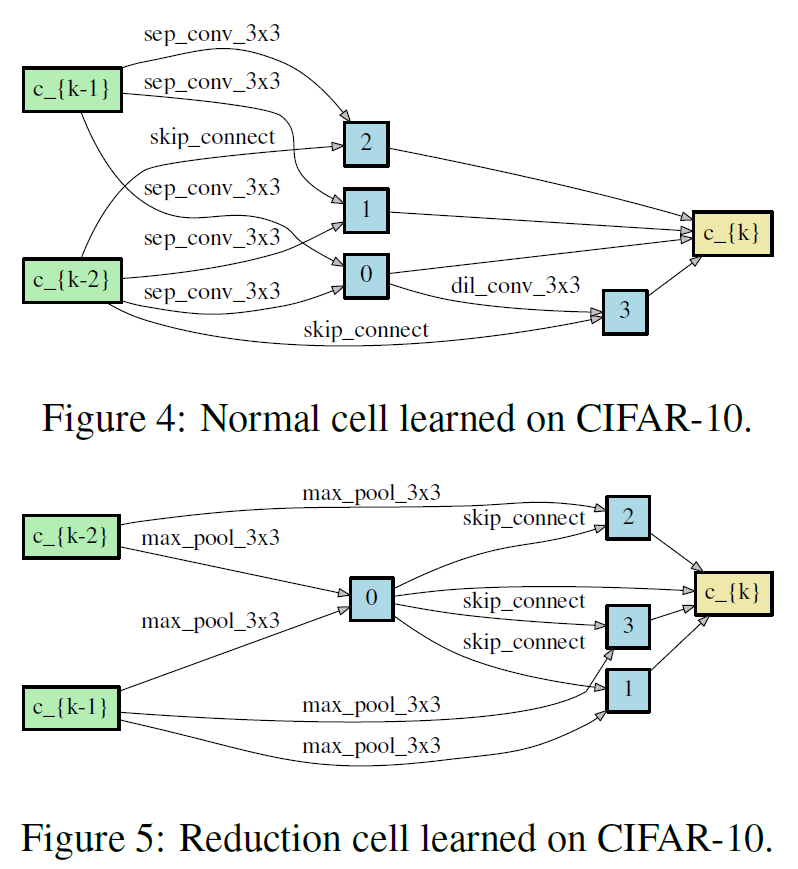

 # Differentiable Architecture Search
https://github.com/quark0/darts


## 文件说明

```
architect.py	 #文件模块  
model.py	#文件模块，在两个数据集上的网络结构定义           
utils.py	#文件模块
             
visualize.py	#绘图模块
operations.py	#文件模块,定义操作集
genotypes.py	#文件模块,需要使用的进行对比的方法
```

## 在cifar数据集上的操作

> #### 在一个==<u>8层的Network</u>==上搜索cell的结构，同时训练了weights和alpha

```	
model_search.py	#文件模块，定义了小的模块cell 
train_search.py	#在cifar数据集上搜索模型
```

> #### 通过上述搜索确定cell的结构，即arch='DARTS'的情况下，重新定义了一个==<u>20层的Network</u>==，接着去训练weights

```
train.py	#在cifar数据集上训练模型	
test.py	    #在cifar数据集上测试了性能
```

## 在Imagenet数据集上的操作，即进行迁移学习
```
train_imagenet.py	在imagenet数据集上进行训练  
test_imagenet.py	在imagenet数据集上进行测试 
Code accompanying the paper
```

## 对CNN中代码编写思路的说明
### 模型搜索阶段
#### 在cifar数据集上:
```
Mainly needed files：model_search.py
                     train_search.py
```
* 数据集：将torchvision.datasets.CIFAR10的训练集部分取出，一半作为train_queue，另一半作为valid_queue

  ```python
  train_transform, valid_transform = utils._data_transforms_cifar10(args) #对数据集即将采取的变换，做数据增强
  #导入数据集CIFAR10的作为训练集的一部分train=True
  train_data = dset.CIFAR10(root=args.data, train=True, download=True, transform=train_transform)
  #将一半的训练集数据作为训练队列
  train_queue = torch.utils.data.DataLoader(
    train_data, batch_size=args.batch_size,
    sampler=torch.utils.data.sampler.SubsetRandomSampler(indices[:split]),
    pin_memory=True, num_workers=1)
  #torch.utils.data.sampler.SubsetRandomSampler：采用无放回随机采样
  
  #将另一半的训练集数据作为验证队列
  valid_queue = torch.utils.data.DataLoader(
    train_data, batch_size=args.batch_size,
    sampler=torch.utils.data.sampler.SubsetRandomSampler(indices[split:num_train]),
    pin_memory=True, num_workers=1)
  ```

* 目标：得到每个cell的内部结构。主要用来学习alpha，来确定cell内部的连接结构
##### Network的构建：
```python
textmodel = Network(args.init_channels, CIFAR_CLASSES, args.layers, criterion)
```
参数：

```python
2019-06-26 09:33:18,961 args = Namespace(arch_learning_rate=0.0003, arch_weight_decay=0.001, batch_size=32,cutout=False, cutout_length=16, data='../data', drop_path_prob=0.3, epochs=50, gpu=0, grad_clip=5, init_channels=16, layers=8, learning_rate=0.025, learning_rate_min=0.001, model_path='saved_models', momentum=0.9, report_freq=50, save='search-EXP-20190626-093318', seed=2, train_portion=0.5, unrolled=False, weight_decay=0.0003)
```

在modle_search.py中定义了Network的结构：主要是通过将8个cell的结构进行拼接:

```python
for i in range(layers):
    #总共8层
  if i in [layers//3, 2*layers//3]:
      #在i=2,5的情况下，即第2层和第5层的时候使用reduction结构，一共8层
    C_curr *= 2
    reduction = True
  else:
    reduction = False
  cell = Cell(steps, multiplier, C_prev_prev, C_prev, C_curr, reduction, reduction_prev)
  #cell = Cell(steps=4, multiplier=4, C_prev_prev=48, C_prev=48, C_curr=16, reduction=True/False, reduction_prev=True/False)
  reduction_prev = reduction
  self.cells += [cell] #对cell进行组合
  C_prev_prev, C_prev = C_prev, multiplier*C_curr

self.global_pooling = nn.AdaptiveAvgPool2d(1) #二维自适应平均池化，返回的大小是1*1的
self.classifier = nn.Linear(C_prev, num_classes)
self._initialize_alphas()
```
>最后得到的8层(即有8个cell)Network的结构如下：
* s0=C_prev_prev : s1-->s0
* s1=C_prev:由cell生成s1=torch_cat(4*C_curr)))
* s0和s1是每一层的输入通道的个数
```python
       s0           s1  
C     C_prev_prev  C_prev     C_curr
第0层: 48           48         16
第1层: 48           64         16
第2层: 64           64         32
第3层: 64           128        32
第4层: 128          128        32
第5层: 128          128        64
第6层: 128          256        64
第7层: 256          256        64
```
>对**操作权重alpha**的定义(model_search.py,169line)：
```python
#权重的数量：14*8，初始化两组权重
self.alphas_normal = Variable(1e-3*torch.randn(k, num_ops).cuda(), requires_grad=True) #requires_grad=True要求梯度
self.alphas_reduce = Variable(1e-3*torch.randn(k, num_ops).cuda(), requires_grad=True) #requires_grad=True要求梯度
self._arch_parameters = [self.alphas_normal, self.alphas_reduce,]

def arch_parameters(self):
    return self._arch_parameters
```

其中`requires_grad=True`表示该定义的参数`alpha`也需要进行求梯度。

##### Cell的构建：

```python 
cell = Cell(steps=4, multiplier=4, C_prev_prev=48, C_prev=48, C_curr=16, reduction=True/False, reduction_prev=True/False)
```
在modle_search.py中定义了Cell的结构：主要是通过将8个cell的结构进行拼接:
* **steps=4** 表示每个cell有**4个中间节点**
* multiplier=4 表示**s1=torch_cat(multiplier*C_curr)**
* C_prev_prev=48, C_prev=48 表示两个输入通道的个数
* reduction=True/False, reduction_prev=True/False 表示**是否采用对应的reduction结构**

>在Network的forward中：
```
#对初始的输入图像:3-->48
s0 = s1 = self.stem(input) 
```
>接着在单个Cell中的forward：
```python
def forward(self, s0, s1, weights):
  #预处理操作:48-->16
    s0 = self.preprocess0(s0)
    s1 = self.preprocess1(s1)
  
  #states用来存储中间节点
    states = [s0, s1]
    offset = 0 #偏移量

  #构建Figure1(b):每个中间节点与之前的节点之间都有连接
    for i in range(self._steps):
      s = sum(self._ops[offset+j](h, weights[offset+j]) for j, h in enumerate(states))
      offset += len(states)
      states.append(s)
  #将最后的4个状态进行拼接
    return torch.cat(states[-self._multiplier:], dim=1)
```
使用之前的节点进行加权求和生成下一个节点，构建图(b)的过程

`s = sum(self._ops[offset+j](h, weights[offset+j]) for j, h in enumerate(states))`

对上述代码的解释如下：

```python
offset=0:生成状态s2时，与状态s0和s1都有关系:
      #j=0,h=s0:s0 = self._ops[0](s0, weights[0])
      #j=1,h=s1:s1 = self._ops[1](s1, weights[1])
      sum(s0,s1)
offset=0+2:生成状态s3时，与状态s0，s1和s2都有关系:
      #j=0,h=s0:s0 = self._ops[2](s0, weights[2])
      #j=1,h=s1:s1 = self._ops[3](s1, weights[3])
      #j=2,h=s2:s2 = self._ops[4](s2, weights[4])
      sum(s0,s1,s2)
offset=2+3:
      ......
```
打印cell的genotype,生成节点之间的具体操作，这一部分纯粹是为了给用户看：
```python
genotype = model.genotype()
logging.info('genotype = %s', genotype)
def genotype(self):
#用来生成cell的节点之间的连接结构
def _parse(weights):
  gene = []
  n = 2
  start = 0
  for i in range(self._steps):
    end = start + n
    W = weights[start:end].copy() #在这一部分就已经相应位置的alpha取了出来
    edges = sorted(range(i + 2), key=lambda x: -max(W[x][k] for k in range(len(W[x])) if k != PRIMITIVES.index('none')))[:2]
    #为上面选出的两条边分别确定一个权重最大的操作：j代表边的位置：即起始点的连接节点，相应的i代表对应的终点连接的节点。
    for j in edges:
      k_best = None
      for k in range(len(W[j])):
        if k != PRIMITIVES.index('none'):
          if k_best is None or W[j][k] > W[j][k_best]:
            k_best = k
      gene.append((PRIMITIVES[k_best], j))
      #PRIMITIVES[k_best]：挑选出具有最大权重的操作
      #j in [0,1,2,3,4],代表的是当前节点与几号节点相连，生成的中间节点[2,3,4,5]只保留权重最大的两个操作
    start = end
    n += 1
  return gene
gene_normal = _parse(F.softmax(self.alphas_normal, dim=-1).data.cpu().numpy())
gene_reduce = _parse(F.softmax(self.alphas_reduce, dim=-1).data.cpu().numpy())
concat = range(2+self._steps-self._multiplier, self._steps+2)
genotype = Genotype(
  normal=gene_normal, normal_concat=concat,
  reduce=gene_reduce, reduce_concat=concat
)
return genotype
```
里面wights的解释
```python
#weights.size()=[14,8],14个连线，每个线有8个操作
i=0,[start:end]=[0:2],n=3
i=1,[start:end]=[2:5],n=4
i=2,[start:end]=[5:9],n=5
i=3,[start:end]=[9:14],n=6

#选出权重最大的两条边,即：第i个节点与哪两条边相连
range(i+2)
i=0,range(2)=[0,1]
i=1,range(3)=[0,1,2]
i=2,range(4)=[0,1,2,3]
i=3,range(5)=[0,1,2,3,4]
```
Cell内部genotype的具体连接的操作如下：
```python
#在搜索过程中的第一个genotype的一个示例：
  genotype = Genotype(
  normal=[('max_pool_3x3', 0), ('dil_conv_3x3', 1), 
  ('max_pool_3x3', 1), ('dil_conv_3x3', 2), 
  ('avg_pool_3x3', 0), ('sep_conv_3x3', 3), 
  ('dil_conv_3x3', 4), ('avg_pool_3x3', 2)], 
  normal_concat=range(2, 6), 
  reduce=[('avg_pool_3x3', 1), ('avg_pool_3x3', 0), 
  ('sep_conv_5x5', 2), ('dil_conv_3x3', 1), 
  ('skip_connect', 3), ('dil_conv_5x5', 0), 
  ('sep_conv_3x3', 1), ('avg_pool_3x3', 4)], 
  reduce_concat=range(2, 6))
```
```python
#文章中给出的搜索结果：
DARTS_V1 = Genotype(
normal=[('sep_conv_3x3', 1), ('sep_conv_3x3', 0),
      ('skip_connect', 0), ('sep_conv_3x3', 1),
      ('skip_connect', 0), ('sep_conv_3x3', 1), 
      ('sep_conv_3x3', 0), ('skip_connect', 2)],
normal_concat=[2, 3, 4, 5],
reduce=[('max_pool_3x3', 0), ('max_pool_3x3', 1),
      ('skip_connect', 2), ('max_pool_3x3', 0), 
      ('max_pool_3x3', 0), ('skip_connect', 2), 
      ('skip_connect', 2), ('avg_pool_3x3', 0)],
reduce_concat=[2, 3, 4, 5])
DARTS_V2 = Genotype(
  normal=[('sep_conv_3x3', 0), ('sep_conv_3x3', 1),
      ('sep_conv_3x3', 0), ('sep_conv_3x3', 1),
      ('sep_conv_3x3', 1), ('skip_connect', 0),
      ('skip_connect', 0), ('dil_conv_3x3', 2)],
  normal_concat=[2, 3, 4, 5],
  reduce=[('max_pool_3x3', 0), ('max_pool_3x3', 1),
      ('skip_connect', 2), ('max_pool_3x3', 1), 
      ('max_pool_3x3', 0), ('skip_connect', 2),
      ('skip_connect', 2), ('max_pool_3x3', 1)],
  reduce_concat=[2, 3, 4, 5])

DARTS = DARTS_V2
```

结构图如下：



> **progress_convolutional**：


> **progress_convolutional_normal**


> **progress_convolutional_reduce**


>**progress_recurrent**


### 模型训练阶段

```
Mainly needed files：train.py
```
* 数据集：

  ```python
  #获得预处理之后的训练集和验证集
  train_transform, valid_transform = utils._data_transforms_cifar10(args)
  #获取数据集，将数据集分为训练集和验证集两部分
  train_data = dset.CIFAR10(root=args.data, train=True, download=True, transform=train_transform)
  valid_data = dset.CIFAR10(root=args.data, train=False, download=True, transform=valid_transform)
  ```

  这一部分所采用的验证集`valid_data`与模型测试阶段所采用的数据集`test_data`是一致的。这里的`valid_data`实际上主要用来监控训练阶段每个epoch在验证集`valid_data`上的准确度。

* 目标：在模型搜索的基础上，确定了cell的内部连接结构：即确定了genotype的结构，之后**堆叠20层cell**，相当于是**在固定alpha的情况下重新训练weights**
### 模型测试阶段
```
Mainly needed files：test.py
```
* 模型与数据集：

  ```python
  #构建好和训练阶段一样的模型结构
  model = Network(args.init_channels, CIFAR_CLASSES, args.layers, args.auxiliary, genotype)
  #加载模型的参数
  utils.load(model, args.model_path)
  #导入测试集数据，这里的test_data和模型训练阶段所采用的valid_data是同一部分数据集
  _, test_transform = utils._data_transforms_cifar10(args)
  test_data = dset.CIFAR10(root=args.data, train=False, download=True, transform=test_transform) #transform=test_transform：所采用的变换形式
  ```

  

* 目标：最后测试模型的准确率

## 迁移学习imagenet

```python
Mainly needed files：train_imagenet.py, test_imagenet.py
```
* 模型参数
```python
06/28 04:21:06 PM args = Namespace(arch='DARTS', auxiliary=False, auxiliary_weight=0.4, batch_size=128, data='../data/imagenet/', decay_period=1, drop_path_prob=0, epochs=250, gamma=0.97, gpu=0, grad_clip=5.0, init_channels=48, label_smooth=0.1, layers=14, learning_rate=0.1, momentum=0.9, parallel=False, report_freq=100, save='eval-EXP-20190628-162106', seed=0, weight_decay=3e-05)
```
* Cell结构
```python
06/28 04:21:06 PM genotype = Genotype(
normal=[('sep_conv_3x3', 0), ('sep_conv_3x3', 1), 
('sep_conv_3x3', 0), ('sep_conv_3x3', 1), 
('sep_conv_3x3', 1), ('skip_connect', 0), 
('skip_connect', 0), ('dil_conv_3x3', 2)], 
normal_concat=[2, 3, 4, 5],
reduce=[('max_pool_3x3', 0), ('max_pool_3x3', 1),
 ('skip_connect', 2), ('max_pool_3x3', 1), 
 ('max_pool_3x3', 0), ('skip_connect', 2), 
 ('skip_connect', 2), ('max_pool_3x3', 1)],
reduce_concat=[2, 3, 4, 5])
```
* 目标：
利用上面定义好的cell结构进行拼接成一个14层的Network，重新进行训练得到一组新的参数weights，最后再在新的测试集上进行测试


[1]: https://github.com/quark0/darts/blob/master/img/darts.png
