[TOC]

# 一维卷积：nn.Conv1d

所谓一维卷积，**就是卷积时只看纵列**。初始：7乘5  卷积核：三种大小，分别为$2*5、3*5、4*5$，每种两个。重点是卷积时，**只在纵列一个方向上滑动**。

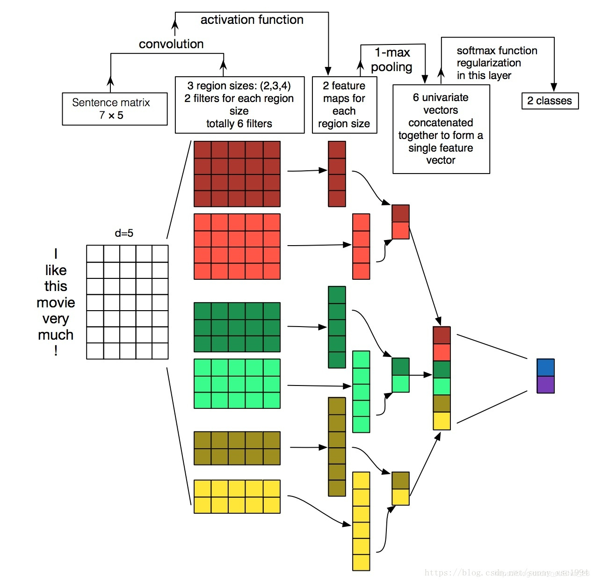

```python
import torch.nn as nn
#定义1维卷积，in_channels=16,out_channels=33,kernel_size=3
m = nn.Conv1d(16, 33, 3, stride=2)
#定义输入：batch*in_channels*L,实际上表示成上图的输入类型为：20*50*16，其中50相当于词的个数，16相当于词向量的维度
input = torch.randn(20, 16, 50)
output = m(input)
output.size()
Out[22]: torch.Size([20, 33, 24])
#其中的参数量：33个3*16，从上往下进行卷积
m.weight.size()
Out[23]: torch.Size([33, 16, 3])
```


# 标准的卷积示意图：

卷积核卷积每个通道得到feature map，然后再将这些feature map做求和操作：


标准的卷积过程可以看上图，一个3×3的卷积核在卷积时，对应图像区域中的所有通道**均被同时考虑**。问题在于，**为什么一定要同时考虑图像区域和通道**？**我们为什么不能把通道和空间区域分开考虑？**

----

[变形卷积核、可分离卷积？卷积神经网络中十大拍案叫绝的操作](https://zhuanlan.zhihu.com/p/28749411)

# Group convolution 分组卷积

## Alexnet

最早在AlexNet中出现，由于当时的硬件资源有限，训练AlexNet时卷积操作__不能全部放在同一个GPU处理__，因此作者把**feature maps分给多个GPU分别进行处理**，最后把多个GPU的结果进行融合。


如果分组卷积是将通道分在不同GPU上的话，**每个GPU的计算量就降低到 1/groups**。

> 例如：group conv本身应该就大大减少了参数，比如当input channel为256，output channel也为256，kernel size为3*3，不做group conv参数为256*3*3*256，若group为8，每个group的input channel和output channel均为32，参数为8*32*3*3*32，是原来的八分之一。
>
> Alex认为group conv的方式能够增加 filter之间的对角相关性，而且能够减少训练参数，不容易过拟合，这类似于正则的效果。

## 分组卷积能否对通道进行随机分组？-- ShuffleNet

原文地址： [ShuffleNet](https://arxiv.org/pdf/1707.01083.pdf)        代码:[TensorFlow](https://github.com/MG2033/ShuffleNet)\ [Caffe](https://github.com/farmingyard/ShuffleNet)

>ShuffleNet 是 Face++团队提出的，与 MobileNet 一样，发表于 CVPR-2017，但晚于 MobileNet 两个月才在 arXiv 上公开。论文标题：《ShuffleNet： An Extremely Efficient Convolutional Neural Network for Mobile Devices》
>
>原文：https://blog.csdn.net/u011974639/article/details/79200559 
>版权声明：本文为博主原创文章，转载请附上博文链接！

### 针对群卷积的通道混洗(Channel Shuffle for Group Convolutions)

>也称==**混洗分组卷积**==在小型网络中，昂贵的**逐点卷积造成有限的通道之间充满约束**，这会显著的损失精度。为了解决这个问题，一个直接的方法是应用**通道稀疏连接**，例如组卷积(group convolutions)。通过确保每个卷积操作仅在对应的输入通道组上，组卷积可以显著的降低计算损失。然而，如果多个组卷积堆叠在一起，会有一个副作用： **某个通道输出仅从一小部分输入通道中导出，如下图(a)所示，这样的属性降低了通道组之间的信息流通，降低了信息表示能力**。


#### 具体操作方法：

* 1.有g×n g×ng×n个输出通道
* 2.reshape为(g,n) (g,n)(g,n)
* 3.再转置为(n,g) (n,g)(n,g)
* 4.平坦化,再分回g gg组作为下一层的输入


# Inception卷积及改进

## 每层卷积只能用一种尺寸的卷积核？-- Inception结构

### Inception v1
论文：Going deeper with convolutions
论文链接：https://arxiv.org/pdf/1409.4842v1.pdf

| [多尺寸卷积核](https://www.davex.pw/2018/02/05/breadcrumbs-about-inception-xception/#多尺寸卷积核) | [Pointwise Conv逐点卷积](https://www.davex.pw/2018/02/05/breadcrumbs-about-inception-xception/#Pointwise-Conv) |
| ------------------------------------------------------------ | ------------------------------------------------------------ |
|  |  |

### Inception v3

论文：Rethinking the Inception Architecture for Computer Vision

论文地址：https://arxiv.org/pdf/1512.00567v3.pdf

> Inception v2 和 Inception v3 来自同一篇论文《Rethinking the Inception Architecture for Computer Vision》，作者提出了一系列能增加准确度和减少计算复杂度的修正方法。

> #### [卷积核替换](https://www.davex.pw/2018/02/05/breadcrumbs-about-inception-xception/#卷积核替换)
>
> 将 5×5 的卷积分解为两个 3×3 的卷积运算以提升计算速度:
>
> 此外，作者将 n*n 的卷积核尺寸分解为 1×n 和 n×1 两个卷积。例如，一个 3×3 的卷积等价于首先执行一个 1×3 的卷积再执行一个 3×1 的卷积。他们还发现这种方法在成本上要比单个 3×3 的卷积降低 33%

| 一个5*5的卷积核可以用两个3x3卷积核代替                    | V1-->V3                                                      |
| --------------------------------------------------------- | ------------------------------------------------------------ |
| 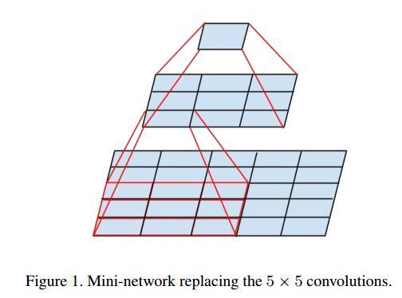 |  |

**参数对比：**

我们假设输入 256 维，输出 512 维，计算一下参数量：

* **5x5 卷积核**

  $256∗5∗5∗512=3276800256∗5∗5∗512=3276800$

* **两个 3x3 卷积核**

  $256∗3∗3∗256+256∗3∗3∗512=589824+1179648=1769472256∗3∗3∗256+256∗3∗3∗512=589824+1179648=1769472$

**结果对比**

1769472/3276800=0.5417694723276800=0.54

我们可以看到参数量对比，两个 3x3 的卷积核的参数量是 5x5 一半，可以大大加快训练速度。

>#### 卷积核7x1_1x7的实现

```python
 'conv_7x1_1x7' : lambda C, stride, affine: nn.Sequential(
    nn.ReLU(inplace=False),
    nn.Conv2d(C, C, (1,7), stride=(1, stride), padding=(0, 3), bias=False),
    nn.Conv2d(C, C, (7,1), stride=(stride, 1), padding=(3, 0), bias=False),
    nn.BatchNorm2d(C, affine=affine)
    )
```

## 由Inception向Xception的演变

> Xception 是 Google 提出的，arXiv 的 V1 版本 于 2016 年 10 月公开。论文标题：《Xception: Deep Learning with Depth-wise Separable Convolutions》

| Inception module                                             | 简化了的 inception module                                    |
| ------------------------------------------------------------ | ------------------------------------------------------------ |
|  |  |
| 再进一步假设，**把第一部分的 3 个 1X1 卷积核统一起来，变成一个 1X1 的，后面的 3 个 3*3 的分别「负责」一部分通道**： | 最后提出「extreme」version of an Inception，module Xception 登场，**先用 1*1 卷积核对各通道之间（cross-channel）进行卷积** |
|  |  |

> **示意图**


>Xception 与原版的 Depth-wise convolution 有两个不同之处:
>
>1. 第一个：原版 Depth-wise convolution，先逐通道卷积，再 1X1 卷积; 而 Xception 是反过来，先 1X1 卷积，再逐通道卷积；
>2. 第二个：原版 Depth-wise convolution 的两个卷积之间是不带激活函数的，而 Xception 在经过 1*1 卷积之后会带上一个 Relu 的非线性激活函数；
>
>Xception 是基于 Inception-V3，并结合了 depth-wise convolution，这样做的好处是**提高网络效率**，以及**在同等参数量的情况下，在大规模数据集上，效果要优于 Inception-V3**。这也提供了另外一种「轻量化」的思路：在硬件资源给定的情况下，尽可能的增加网络效率和性能，也可以理解为充分利用硬件资源。

## ResNeXt：Resnet与Inception 'Split + Transfrom + Concat'

[经典分类CNN模型系列其八：ResNeXt](https://www.jianshu.com/p/7478ce41e46b)

论文地址：[Aggregated Residual Transformations for Deep Neural Networks](https://arxiv.org/abs/1611.05431) (2016)
代码地址：[GitHub](https://github.com/facebook/fb.resnet.torch) 

> ResNeXt可以说是基于**Resnet与Inception 'Split + Transfrom + Concat'**而搞出的产物，结构简单、易懂又足够强大。在行业标志性的Imagenet 1k数据集上它取得了比Resnet/Inception/Inception-Resnet系列更佳的效果。

* 以下为构成**ResNeXt网络**的基本block单元：


> 三种等价的形式


# **可分离卷积（Separable Convolutions）**

## 深度可分离卷积（Depthwise Separable Convolutions）

### 卷积操作时必须同时考虑通道和区域吗？

>**思想来源：**
>
>    depth-wise convolution是借鉴的，最早关于separable convolution的介绍，Xception作者提到，应该追溯到Lau- rent Sifre 2014年的工作 [Rigid-Motion Scattering For Image Classification](https://link.zhihu.com/?target=http%3A//www.di.ens.fr/data/publications/papers/phd_sifre.pdf) 6.2章节。这个注意最早是来自这篇论文 [Design of Efficient Convolutional Layers using Single Intra-channel Convolution, Topological Subdivisioning and Spatial “Bottleneck” Structure ](https://arxiv.org/abs/1608.04337)，后面被 `Google` 用在 `MobileNet` 和 `Xception` 中发扬光大。
###**MobileNet**

> MobileNet 由 Google 团队提出，发表于 CVPR-2017，论文标题：《MobileNets: Efficient Convolutional Neural Networks for Mobile Vision Applications》


>**MobileNet 将标准卷积分成两步：**
>
>1. 第一步 Depth-wise convolution, 即逐通道的卷积，一个卷积核负责一个通道，一个通道只被一个卷积核「滤波」；
>2. 第二步，Pointwise convolution，将 depth-wise convolution 得到的 feature map 再「串」起来，注意这个「串」是很重要的（促进不同通道之间信息的流通）。

* 更为完整的示意图：:happy:


> **操作步骤：**
>
> 1. 在输入层上应用深度卷积。**使用3个卷积核分别对输入层的3个通道作卷积计算**，再堆叠在一起；
> 2. 重复多次1x1的卷积操作（如下图为128次），则最后便会得到一个深度的卷积结果。

### MobileNet 的网络结构:

> MobileNet 共 28 层，可以发现这里下采样的方式没有采用池化层，而是利用 depth-wise convolution 的时候将步长设置为 2，达到下采样的目的。


###  depth-wise convolution 和 group convolution 是类似的:

>**depth-wise convolution** 是一个卷积核负责一部分 feature map，每个 feature map 只被一个卷积核卷积；**group convolution** 是一组卷积核负责一组 feature map，每组 feature map 只被一组卷积核卷积。Depth-wise convolution 可以看成是特殊的 group convolution，即每一个通道是一组。

#### 挑战：
>
>采用 depth-wise convolution 会有一个问题，就是导致「信息流通不畅」，即输出的 feature map 仅包含输入的 feature map 的一部分，在这里，MobileNet 采用了 **point-wise convolution 解决这个问题**。

#### depth-wise separable convolution代码实现

```python
class SepConv(nn.Module):
# 'sep_conv_3x3' : lambda C, stride, affine: SepConv(C, C, 3, stride, 1, affine=affine),
  def __init__(self, C_in, C_out, kernel_size, stride, padding, affine=True):
    super(SepConv, self).__init__()
    self.op = nn.Sequential(
      nn.ReLU(inplace=False),
      nn.Conv2d(C_in, C_in, kernel_size=kernel_size, stride=stride, padding=padding, groups=C_in, bias=False),
      nn.Conv2d(C_in, C_in, kernel_size=1, padding=0, bias=False),
      nn.BatchNorm2d(C_in, affine=affine),
      nn.ReLU(inplace=False),
      nn.Conv2d(C_in, C_in, kernel_size=kernel_size, stride=1, padding=padding, groups=C_in, bias=False),
      nn.Conv2d(C_in, C_out, kernel_size=1, padding=0, bias=False),
      nn.BatchNorm2d(C_out, affine=affine),
      )
    #nn.ReLU(inplace=False),参数：inplace – 选择是否进行覆盖运算 Default: False

  def forward(self, x):
    return self.op(x)
```

关键操作**groups=C_in**：

```python
nn.Conv2d(C_in, C_in, kernel_size=kernel_size, stride=stride, padding=padding, groups=C_in, bias=False)
```

## **空间可分离卷积（Spatially Separable Convolutions）**

>空间可分卷积的主要问题是**并非所有卷积核都可以“分离”成两个较小的卷积核**。 这在训练期间变得特别麻烦，因为网络可能采用所有可能的卷积核，它最终只能使用可以分成两个较小卷积核的一小部分。[^不常用]:cry:

最著名的可在空间上分离的卷积是用于**边缘检测的sobel卷积核**：

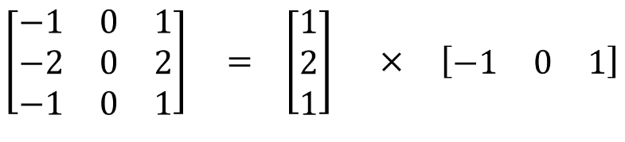 | 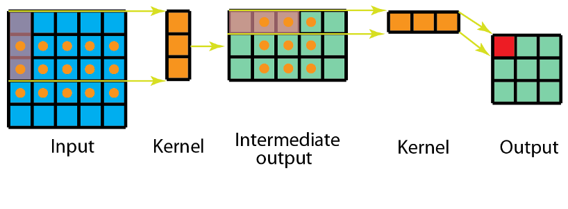

# 能否让固定大小的卷积核看到更大范围的区域？-- Dilated convolution扩张卷积/空洞卷积

>论文地址：[[1511.07122\] Multi-Scale Context Aggregation by Dilated Convolutions(2016)](https://link.zhihu.com/?target=https%3A//arxiv.org/abs/1511.07122)
>
>源码地址：[fyu/dilation](https://link.zhihu.com/?target=https%3A//github.com/fyu/dilation)

`既然网络中加入pooling层会损失信息，降低精度。那么不加pooling层会使感受野变小，学不到全局的特征。如果我们单纯的去掉pooling层、扩大卷积核的话，这样纯粹的扩大卷积核势必导致计算量的增大，此时最好的办法就是Dilated Convolutions（扩张卷积或叫空洞卷积）`

|  |  |
| :------------------------------------------------------: | :-------------------------------------------------------: |
|                **Standard Convolution **                 |      **Dilated Convolution with a dilation rate 2**       |

## 标准卷积

使用卷积核大小为3X3、填充为1，步长为2的卷积操作对输入为5*5的特征图进行卷积生成3X3的特征图。

## 空洞卷积

使用卷积核大小为3X3、空洞率（dilated rate）为2、卷积步长为1的空洞卷积操作对输入为7X7的特征图进行卷积生成3X3的特征图。

> 为扩大感受野，在卷积核里面的元素之间插入空格来“膨胀”内核，形成“空洞卷积”（或称膨胀卷积），并用膨胀率参数L表示要扩大内核的范围，即在内核元素之间插入**L-1**个空格。当L=1时，则内核元素之间没有插入空格，变为标准卷积。

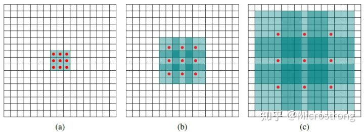

>- (a)图对应3x3的扩张率为1的卷积，和普通的卷积操作一样；
>- (b)图对应3x3的扩张率为2的卷积，实际的卷积核还是3x3，但是空洞率为2，可以理解为卷积核的大小为7x7，但是只有图中的9个点的权重不为0，其余都为0。可以看到虽然卷积核的大小只有3x3，但是这个卷积的感受野已经增大到了7x7。如果考虑到这个2-dilated convolution的前一层有一个1-dilated convolution的话，那么每个红点就是1-dilated的卷积输出，感受野为3x3，所以1-dilated和2-dilated合起来就能达到7x7的卷积；
>- (c)图是4-dilated convolution操作，同理跟在1-dilated和2-dilated convolution的后面，能达到15x15的感受野。

**3层$3*3$的卷积加起来，stride为1的话，只能达到$(kernel-1)*layer+1=7$的感受野，也就是==和层数layer成线性关系==，而==dilated conv的感受野是指数级的增长==。**

> **多尺度核与多膨胀率：**
>
> 在这篇Timeception for Complex Action Recognition文章中的Fixed-size vs. Multi-scale Temporal Kernels的实验结果说明多尺度核与多膨胀率具有相似的实验效能。但是从参数量上来说空洞卷积更占优势。相同的参数在不同的膨胀率的情况下可以达到更大视野的效果。

## dilated separable convolutions扩张可分离式卷积

```python
#'dil_conv_3x3' : lambda C, stride, affine: DilConv(C, C, 3, stride, 2, 2, affine=affine)
class DilConv(nn.Module):   
  def __init__(self, C_in, C_out, kernel_size, stride, padding, dilation, affine=True):
    super(DilConv, self).__init__()
    self.op = nn.Sequential(
      nn.ReLU(inplace=False),
      nn.Conv2d(C_in, C_in, kernel_size=kernel_size, stride=stride, padding=padding, dilation=dilation, groups=C_in, bias=False),
      nn.Conv2d(C_in, C_out, kernel_size=1, padding=0, bias=False),
      nn.BatchNorm2d(C_out, affine=affine),
      )

  def forward(self, x):
    return self.op(x)
```

核心代码：

```python
nn.Conv2d(C_in, C_in, kernel_size=kernel_size, stride=stride, padding=padding, dilation=dilation, groups=C_in, bias=False)
```

其中的，

* ***dilation=2***表明使用了dilated convolutions

* ***groups=C_in***，说明该模块既采用了separable convolutions

# **反卷积（转置卷积）（Deconvolution / Transposed Convolution）**

| 假如将一张5×5大小的图像输入到卷积层，其中步幅为2，卷积核为3×3，无边界扩充。 | 卷积核为3×3、步幅为2和无边界扩充的二维转置卷积 | 在2x2的输入图像上应用步长为1、边界全0填充的3x3卷积核二维转置卷积 |
| ------------------------------------------------------------ | ---------------------------------------------- | ------------------------------------------------------------ |
| 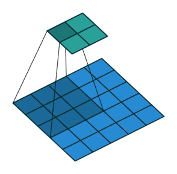                    | 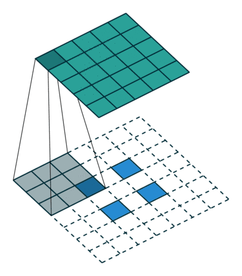      | 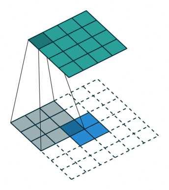       |

>卷积是对输入图像提取出特征（可能尺寸会变小），而所谓的“反卷积”便是进行相反的操作。但这里说是“反卷积”并不严谨，因为并不会完全还原到跟输入图像一样，一般是还原后的尺寸与输入图像一致，主要用于向上采样。从数学计算上看，“反卷积”相当于是将卷积核转换为稀疏矩阵后进行转置计算，因此，也被称为“转置卷积”

# **扁平卷积（Flattened convolutions）**

[Flattened convolutional neural networks for feedforward acceleration(2015)](https://arxiv.org/abs/1412.5474)

>这种卷积的思路就是应用卷积核分离，即将标准的卷积核拆分为 3 个 1D 卷积核，而不是直接应用一个标准的卷积核来将输入层映射为输出层。这个思路类似于前部分所提到的**空间可分离卷积**，其中的一个空间卷积核近似于两个 rank-1 过滤器

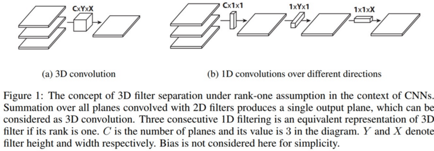

>这篇论文声称，通过使用由连续的 1D 过滤器组成的扁平化网络在 3D 空间的所有方向上训练模型，**能够提供的性能与标准卷积网络相当**，不过由于学习**参数的显著减少，其计算成本要更低得多**。
>
>

# 特征重标定卷积

[Squeeze-and-Excitation Networks(2019)](http://link.zhihu.com/?target=http%3A//xueshu.baidu.com/s%3Fwd%3Dpaperuri%3A%28da0fc2c7de78dd67ef29faed8f93bfd5%29%26filter%3Dsc_long_sign%26tn%3DSE_xueshusource_2kduw22v%26sc_vurl%3Dhttp%3A%2F%2Farxiv.org%2Fabs%2F1709.01507%26ie%3Dutf-8%26sc_us%3D6552007361094053595)

>这是 ImageNet 2017 竞赛 Image Classification 任务的冠军模型 SENet 的核心模块，原文叫做”Squeeze-and-Excitation“。
>
>一个卷积层中往往有数以千计的卷积核，而且我们知道卷积核对应了特征，于是乎那么多特征要怎么区分？这个方法就是通过学习的方式来**自动获取到每个特征通道的重要程度**，然后**==依照计算出来的重要程度去提升有用的特征并抑制对当前任务用处不大的特征==**。

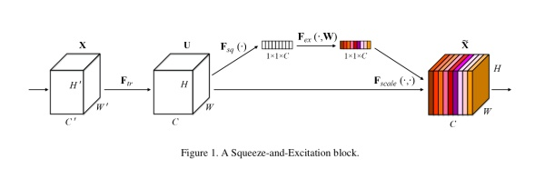

> **实现：**
>
> 1. 首先做普通的卷积，得到了一个的 output feature map，它的 shape 为 [C，H，W]，根据 paper 的观点，**这个 feature map 的特征很混乱；**
> 2. 然后为了获得重要性的评价指标，直接对这个 feature map 做一个 **Global Average Pooling**，然后我们就得到了长度为 C 的向量。（这里还涉及到一个额外的东西，如果你了解卷积，你就会发现**==一旦某一特征经常被激活，那么 Global Average Pooling 计算出来的值会比较大==**，说明它对结果的影响也比较大，反之越小的值，对结果的影响就越小）；
> 3. 然后我们对**这个向量加两个 FC 层**，做非线性映射，这俩 FC 层的参数，也就是网络需要额外学习的参数；
> 4. **最后输出的向量，我们可以看做特征的重要性程度**，然后与 feature map 对应 channel 相乘就得到特征有序的 feature map 了。

| SE-Inception Module                                          | SE-ResNet Module                                             |
| ------------------------------------------------------------ | ------------------------------------------------------------ |
| 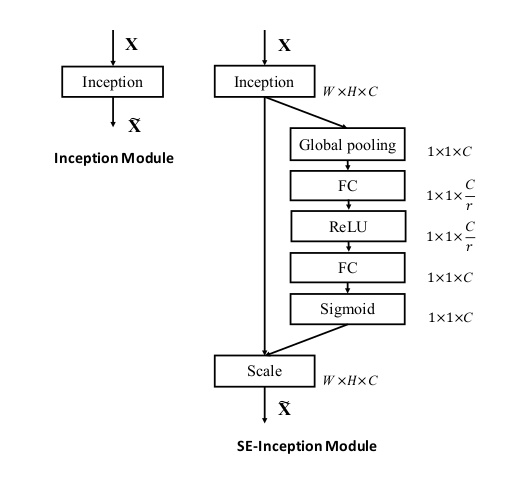 | 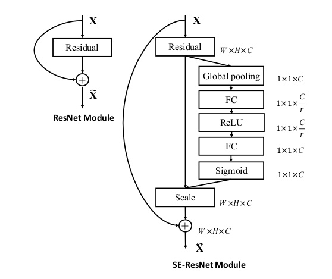 |

