# 思路

## 初代网络

### 特征与评价

#### 特征

> - 全局搜索(global-based)
> - 从头搜索, 模型从零开始构建
> - 从零训练, 对候选模型进行完整的训练, 评估其性能
> - 使用RL和EA算法, 离散的搜索空间

#### 对EA和RL的评价：

> - EA: When using evolutionary algorithms (EA), each neural network structure is encoded as a string, and random mutations and recombinations of the strings are performed during the search process; each string (model) is then trained and evaluated on a validation set, and the top performing models generate “children”. 
>
> - RL: When using reinforcement learning (RL), the agent performs a sequence of actions, which specifies the structure of the model; this model is then trained and its validation performance is returned as the reward, which is used to update the RNN controller. 
> - Although both EA and RL methods have been able to learn network structures that outperform manually designed architectures, they require significant computational resources. For example, the RL method in [41] trains and evaluates 20,000 neural networks across 500 P100 GPUs over 4 days.
>
> Progressive Neural Architecture Search (ECCV'18)

| Title                                                        | Venue   | Type | Idea                                                         |
| :----------------------------------------------------------- | :------ | ---- | ------------------------------------------------------------ |
| [Neural Architecture Search with Reinforcement Learning](./17-iclr-Neural Architecture Search with Reinforcement Learning.pdf) [笔记](#NEURAL ARCHITECTURE SEARCH WITH REINFORCEMENT LEARNING (ICLR'17)) | ICLR'17 | RL   | 将模型的框架视为一系列变长的string，使用RNN作为控制器来生成string作为对应的architecture，把acc作为奖励，通过更新RNN的参数θ来调整最优模型的选择。对整个architecture进行搜索，**24000 GPU days |
| [DESIGNING NEURAL NETWORK ARCHITECTURES USING REINFORCEMENT LEARNING](./17-iclr-Designing_Neural_Network_Architectures_using_Reinf.pdf) [笔记](#DESIGNING NEURAL NETWORK ARCHITECTURES USING REINFORCEMENT LEARNING （ICLR'17）) | ICLR'17 | RL   | 将框架的选择视为一个马尔卡弗决策过程，通过使用Q-learning来选择框架，100 GPU days |
| [Large-Scale Evolution of Image Classifiers](./17-icml-Large-Scale Evolution of Image Classifiers.pdf) [笔记](#Large-Scale Evolution of Image Classifiers (ICML'17)) | ICML'17 | EA   | 需要注意的是该算法对于变异后的子代weight形状没有改变的框架可以**继承父代框架的权重** |
| [Genetic CNN](./17-ICCV-Genetic CNN.pdf) [笔记](#Genetic CNN(ICCV'17)) | ICCV'17 | EA   | 对网络的结构进行编码，将编码作为网络的DNA，之后对该段编码进行变异（修改其中某位编码）或交叉得到新的网络结构 - 从头搜索： 随机初始化一批定长的二进制编码 |

#### Global

|      | Title                                                        | Venue | Idea                                                         | Type      |
| ---- | ------------------------------------------------------------ | ----- | ------------------------------------------------------------ | --------- |
| 1    | [Fast and Practical Neural Architecture Search](./19-ICCV-Cui_Fast_and_Practical_Neural_Architecture_Search_ICCV_2019_paper.pdf) | ICCV  | 我们的方法是搜索整个网络架构，以保证块的多样性，而不是重复堆积一组相似的块。我们将搜索过程建模为一个双层优化问题，并提出一个近似解。 | global,RL |
| 2    |                                                              |       |                                                              |           |

## 优化策略

### 重构搜索空间

> (针对搜索空间)

#### 基于cell

> 减小搜索空间,降低搜索的复杂度,通过将搜索的cell进行拼接得到最终的网络

|      | Title                                                        |   Venue    | Type | Idea                                                         |
| ---- | :----------------------------------------------------------- | :--------: | :--: | ------------------------------------------------------------ |
| 1    | NASNet: [Learning Transferable Architectures for Scalable Image Recognition](./18-CVPR-Learning Transferable Architectures for Scalable Image Recognition.pdf) |  CVPR'18   |  RL  | 提出标准的normal cell 和 reduction cell,NASNet使用了48000 GPU-hours |
| 2    | Block-QNN：[Practical Block-wise Neural Network Architecture Generation](./18-cvpr-Zhong_Practical_Block-Wise_Neural_CVPR_2018_paper.pdf) |  CVPR’18   |  RL  | 使用Q-learning搜索block，通过拼接得到最佳的网络结构，大大降低了搜索空间 |
| 3    | Progressive Neural Architecture Search [笔记](#Progressive Neural Architecture Search (ECCV'18)) |  ECCV'18   |  PD  | 基于cell,  使用步长为2的可分离操作代替reductioncell，提出渐进式的搜索,从更简单的结构逐渐增加block增加cell的复杂度,最后拼接cell |
| 4    | [DPP-Net: Device-aware Progressive Search for areto-optimal Neural Architectures](./18-ECCV-Jin-Dong_Dong_DPP-Net_Device-aware_Progressive_ECCV_2018_paper.pdf) |  ECCV‘18   |      | 使用avg pooling代替 reduction cell，并使用了包括cell在内的密集连接构建网络架构，提出针对设备的多目标优化 |
| 5    | [DARTS: Differentiable Architecture Search](./19-iclr-DARTS DIFFERENTIABLE ARCHITECTURE SEARCH.pdf) |  ICLR'19   |  G   | 基于cell                                                     |
| 7    | [Hierarchical Representations for Efficient Architecture Search](./18-iclr-hierarchical_representations_for_efficient_architecture_search.pdf) |   ICLR18   |      | 提出网络结构的**层级表示**，使用进化算法学习cell，堆叠       |
|      |                                                              |            |      |                                                              |
| 6    | [Evolving Space-Time Neural Architectures for Videos](./19-iccv-Evolving Space-Time Neural Architectures for Videos.pdf) |   ICCV19   |  EA  | 为视频任务设计搜索空间                                       |
| 8    | [AutoDispNet: Improving Disparity Estimation With AutoML](./19-iccv-Saikia_AutoDispNet_Improving_Disparity_Estimation_With_AutoML_ICCV_2019_paper.pdf) |   ICCV19   |  G   | 我们展示了如何使用和扩展现有的自动化技术，以有效地优化大规模的类似于u - net的编解码器架构。特别地，我们利用基于梯度的神经结构搜索和贝叶斯优化来进行超参数搜索。 |
| 9    | AmoebaNet: [Regularized Evolution for Image Classifier Architecture Search](./AmoebaNet.pdf) |            |      |                                                              |
| 10   | [Understanding Architectures Learnt by Cell-based Neural Architecture Search](./Understanding Architectures Learnt by Cell-based Neural Architecture Search.pdf) |  ICLR'20   |  G   | 基于cell                                                     |
|      | [Searching for Efficient Multi-Scale Architectures for Dense Image Prediction](./18-NeurIPS-searching-for-efficient-multi-scale-architectures-for-dense-image-prediction.pdf) [可参考](https://blog.csdn.net/mooneve/article/details/83144385) | NeurIPS'18 |  -   | 为密集图像预测任务(图像的语义分割)有针对性的精心设计搜索空间 dense prediction cell |
| 11   | [AutoGAN: Neural Architecture Search for Generative Adversarial Networks](./19-iccv-AutoGAN.pdf) |   ICCV19   |  RL  | cell，针对GAN任务使用不同的RNN控制器生成每个cell（即），引入参数共享动态重置策略来加速训练 |
|      | [Deep learning architecture search by neuro-cell-based evolution with function-preserving mutations](Deep learning architecture search by neuro-cell-based evolution with function-preserving mutations.pdf) |            |      |                                                              |

#### 其他设计

| Title                                                        | Venue     | Type | Idea                                                         |
| ------------------------------------------------------------ | --------- | ---- | ------------------------------------------------------------ |
| [Discovering Neural Wirings](./19-NeurIPS-Discovering Neural Wirings.pdf) | NeurIPS19 | G    | 提出了一种发现神经线路的方法。我们放松了层的典型概念，使通道能够形成相互独立的连接。 |
| [Towards modular and programmable architecture search](./19-NeurIPS-Towards modular and programmable architecture.pdf) | NeurIPS19 | -    | 提出了一种形式化的语言来编码一般计算图形上的搜索空间         |
| [Densely Connected Search Space for More Flexible Neural Architecture Search](Densely Connected Search Space for More Flexible Neural Architecture Search.pdf) [可参考](https://www.jianshu.com/p/79cb54fea1ec) | CVPR'20   | G    | 重构搜索空间。构建密集连接的搜索空间，能够自动搜索网络的宽度 |
| [AtomNAS: Fine-Grained End-to-End Neural Architecture Search](./atomnas_fine_grained_end_to_end_neural_architecture_search.pdf) | ICLR’20   | -    | 提出由原子组成的细粒度搜索空间                               |
| [FasterSeg: Searching for Faster Real-time Semantic Segmentation](https://openreview.net/pdf?id=BJgqQ6NYvB) [可参考](https://zhuanlan.zhihu.com/p/98956382) | ICLR20    | G    | 为实时的语义分割任务设计搜索空间                             |

### 加速搜索阶段训练过程

> (针对对候选模型进行完整的训练, 对候选模型进行性能排序)

#### 参数共享(weight sharing)

> 不再对每个候选网络都从零开始训练, 以one-shot为代表的一类网络框架,不同的框架之间共享同一个超级网络的权重，以此来加速网络模型的训练

|      | Title                                                        | Venue     |    Type     | Idea                                                         |
| ---- | ------------------------------------------------------------ | --------- | :---------: | ------------------------------------------------------------ |
| 1    | [HYPERNETWORKS](./HYPERNETWORKS.pdf)                         | 17        |             |                                                              |
| 2    | [SMASH: One-Shot Model Architecture Search through HyperNetworks](./18-iclr-SMASH One-Shot Model Architecture Searchthrough HyperNetworks.pdf) | ICLR18    | G，one-shot | 将节点之间的操作视为一种内存读取机制，将编码向框架结构之间建立映射（没看懂），为上面一篇论文的one-shot模型做铺垫 |
| 1    | [ENAS: Efficient Neural Architecture Search via Parameter Sharing](./18-icml-Efficient Neural Architecture Search via Parameter Sharing.pdf) | ICML'18   |      -      | 提出通过权重共享提升搜索效率                                 |
| 3    | [Understanding and Simplifying One-Shot Architecture Search](./18-icml-Understanding and Simplifying One-Shot Architecture Search.pdf) | ICML'18   |      G      | 理解weight sharing的机制和原理                               |
| 4    | [Graph hypernetworks for neural architecture rsearch](./GRAPH HYPERNETWORKS FOR.pdf) | ICLR19    |      G      |                                                              |
| 5    | CAS: [Continual and Multi-Task Architecture Search](./19-acl-Continual and Multi-Task Architecture Search.pdf) | ACL19     |     RL      | 基于ENAS的多任务框架搜索                                     |
| 6    | [One-Shot Neural Architecture Search via Self-Evaluated Template Network](./Dong_One-Shot_Neural_Architecture_Search_via_Self-Evaluated_Template_Network_ICCV_2019_paper.pdf) | ICCV19    |      G      | 权重共享G                                                    |
| 2,7  | [AutoGAN: Neural Architecture Search for Generative Adversarial Networks](./19-iccv-AutoGAN.pdf) | ICCV19    |     RL      | global，针对GAN任务使用不同的RNN控制器生成每个cell（即），引入参数共享动态重置策略来加速训练 |
| 2,   | [DetNAS: Backbone Search for Object Detection](./19-NeurIPS-detnas-backbone-search-for-object-detection.pdf) | NeurIPS19 |             | 采用one-shot架构，为目标检测搜索骨干网络                     |
| 8    | [Evaluating The Search Phase of Neural Architecture Search](./20-iclr-evaluating_the_search_phase_of_neural_architecture_search.pdf) | ICLR’20   |      -      | 提出权重共享策略降低候选NAS框架的排名，导致不能反映它们真实的性能，降低了搜索过程的效率 还提出当前的**NAS搜索的框架平均性能与随机的搜索性能近似**。 |
| 9    | [Once for All: Train One Network and Specialize it for Efficient Deployment](./20-iclr-Once for All Train One Network and Specialize it for Efficient Deployment.pdf) [笔记](#ONCE-FOR-ALL: TRAIN ONE NETWORK AND SPECIALIZE IT FOR EFFICIENT DEPLOYMENT ON DIVERSE HARDWARE PLATFORMS  （ICLR20）) | ICLR’20   |      G      | 子网络之间相互共享权重，为了避免子网络之间相互影响，提出渐进收缩算法。 |
| 10   | [Block-wisely Supervised Neural Architecture Search with Knowledge Distillation](./20-cvpr-Block-wisely Supervised Neural Architecture Search with Knowledge Distillation.pdf) [可参考]([https://www.jiqizhixin.com/articles/2020-03-19-8?from=synced&keyword=%E5%A6%82%E4%BD%95%E5%90%8C%E6%97%B6%E4%BF%9D%E8%AF%81NAS%E7%9A%84%E6%95%88%E7%8E%87%E5%92%8C%E6%9C%89%E6%95%88%E6%80%A7?%E6%9A%97%E7%89%A9%E6%99%BA%E8%83%BD%E7%AD%89%E6%8F%90%E5%87%BA%E5%9F%BA%E4%BA%8E%E7%9F%A5%E8%AF%86%E8%92%B8%E9%A6%8F%E7%9A%84%E5%88%86%E5%9D%97%E7%9B%91%E7%9D%A3%E7%A5%9E%E7%BB%8F%E7%BD%91%E7%BB%9C%E6%90%9C%E7%B4%A2%E7%AE%97%E6%B3%95](https://www.jiqizhixin.com/articles/2020-03-19-8?from=synced&keyword=如何同时保证NAS的效率和有效性?暗物智能等提出基于知识蒸馏的分块监督神经网络搜索算法)) | CVPR'20   |      G      | 通过分块来改进权重共享机制。利用来自教师模型不同深度的监督信息，将原本端到端的网络搜索空间在深度上分块，*实现对网络搜索空间独立**分块**的**权重**共享训练，大大降低了**权重**共享带来的干扰*。在不牺牲权重共享的高效率的同时，也保证了对候选子模型的评估准确性，同时通过算法实现对搜索空间中所有候选结构的遍历 |
| 11   | [Overcoming Multi-Model Forgetting in One-Shot NAS with Diversity Maximization](./20-cvpr-Overcoming Multi-Model Forgetting in One-Shot NAS with Diversity Maximization.pdf) | CVPR'20   |      G      | 对权重共享机制进行改进。解决超网络训练过程中训练新网络导致旧网络性能下降的问题（即多模型遗忘问题），将one-shot NAS中的超网训练描述为一个持续学习的约束优化问题，即当前体系结构的学习不应该降低以前体系结构的性能。 |
|      |                                                              |           |             |                                                              |

#### 性能预测

> 不再对每个候选模型都从零开始训练, 使用预测函数, 得到候选模型的相对性能排序

|      | Title                                                        |   Venue    | Type  | Idea                                                |
| ---- | :----------------------------------------------------------- | :--------: | :---: | :-------------------------------------------------- |
| 9    | Peephole: Predicting network performance before training |     17     |       |                                                     |
| 4    | [Learning Curve Prediction with Bayesian Neural Networks](17-ICLR-LEARNING CURVE PREDICTION WITH BAYESIAN NEURAL NETWORKS.pdf) |  ICLR'17   |  PD   | 使用Bayesian neural network对学习曲线进行建模与预测 |
| 5    | [Accelerating Neural Architecture Search using Performance Prediction](ACCELERATING NEURAL ARCHITECTURE SEARCH USING PERFORMANCE PREDICTION.pdf) | ICLR-W'18  |  PD   |                                                     |
| 6    | PNAS: [Progressive Neural Architecture Search](Chenxi_Liu_Progressive_Neural_Architecture_ECCV_2018_paper.pdf) [笔记](#Progressive Neural Architecture Search (ECCV'18)) |  ECCV'18   |  PD   | 训练一个预测模型预测候选框架的性能                  |
| 7    | [Neural Architecture Optimization](18-NeurIPS-neural-architecture-optimization.pdf) | NeurIPS'18 | PD，G |                                                     |
| 8    | [Multinomial Distribution Learning for Effective Neural Architecture Search](19-ICCV-Zheng_Multinomial_Distribution_Learning_for_Effective_Neural_Architecture_Search_ICCV_2019_paper.pdf) |     19     |       |                                                     |

#### 早期停止

|      | Title                                                        | Venue  | Type | Idea                                               |
| ---- | ------------------------------------------------------------ | ------ | ---- | -------------------------------------------------- |
| 2    | [Hyperband: Bandit-based configuration evaluation for hyperparameter optimization.](hyperband.pdf) | ICLR17 |      | 通过采用自适应的早期停止策略，有效地探索超参数空间 |
| 1    | [Speeding up automatic hyperparameter optimization of deep neural networks by extrapolation of learning curves](peeding Up Automatic Hyperparameter Optimization of.pdf) | AAAI15 |      |                                                    |
| 3    | Speeding up hyper-parameter optimization by extrapolation of learning curves using previous builds |        |      |                                                    |
|      |                                                              |        |      |                                                    |

#### other

|      | Title                                                        | Venue   | Type | Idea                               |
| ---- | ------------------------------------------------------------ | ------- | ---- | ---------------------------------- |
| 1    | [AtomNAS: Fine-Grained End-to-End Neural Architecture Search](https://openreview.net/forum?id=BylQSxHFwr) | ICLR‘20 | -    | 不再是搜索再训练，而是同时搜索训练 |

### 模型重用

> (针对从零开始搜索框架)不再从零开始搜索, 基于已有的网络，在已有的网络上进行模型的修改
>
> [一种新的高效神经架构搜索方法，解决了当前网络变换方法的局限性](http://www.elecfans.com/d/714262.html)

|              | Title                                                        | Venue     | Type | Idea                                                         |
| ------------ | :----------------------------------------------------------- | --------- | ---- | ------------------------------------------------------------ |
| 1            | EAS: [Efficient Architecture Search by Network Transformation](./18-aaai-Efficient Architecture Search by Network Transformation.pdf) [笔记](#Efficient Architecture Search by Network Transformation (AAAI'18)) | AAAI'18   | RL   | 包括扩展层和加深层两个操作                                   |
| 2            | [N2N learning: Network to Network Compression via Policy Gradient Reinforcement Learning](./18-iclr-n2n_learning_network_to_network_compression_via_policy_gradient_reinforcement_learning.pdf) [笔记](#N2N learning: Network to Network Compression via Policy Gradient Reinforcement Learning （ICLR'18）) | ICLR'18   | RL   | 网络模型的压缩，主要包括层的移除与层的压缩两个操作           |
| 3            | [Path-Level Network Transformation for Efficient Architecture Search](18-icml-Path-Level Network Transformation for Efficient Architecture Search.pdf) [笔记](#Path-Level Network Transformation for Efficient Architecture Search（ICML'18）) | ICML'18   |      | 对连接的**路径级别的网络**进行修改，而不仅仅是层级别的       |
| introduction | [Network Pruning via Transformable Architecture Search](./19-NeurIPS-Network Pruning viaTransformable Architecture Search.pdf) | NeurIPS19 | G    | 通过可转移的架构搜索进行**网络剪枝**,使用梯度进行优化        |
|              | [Simple and efficient architecture search for convolutional neural networks](Simple and efficient architecture search for convolutional neural networks.pdf) | ICLR18    | EA   |                                                              |
| 4            | FNA: [Fast Neural Network Adaptation via Parameter Remapping and Architecture Search](20-iclr-FASTNEURALNETWORKADAPTATION  VIAPARAME-TERREMAPPING ANDARCHITECTURESEARCH.pdf) [笔记](#FAST NEURAL NETWORK ADAPTATION VIA PARAMETER REMAPPING AND ARCHITECTURE SEARCH（ICLR20）) | ICLR20    |      | 从一个设计好的人工网络开始，对其进行拓展得到super network，然后做架构自适应得到目标架构，然后做参数自适应得到目标网络。使用了参数重映射。 |

### 梯度优化

> (针对RL与EA的离散搜索空间, 效率低下)变离散的搜索空间为连续的搜索空间,使用梯度的方法进行优化

|                    | Title                                                        | Venue      | Type | Idea                                                         | 亮点描述             |
| ------------------ | :----------------------------------------------------------- | :--------- | ---- | ------------------------------------------------------------ | -------------------- |
| 2                  | [Differentiable Neural Network Architecture Search](./differentiable_neural_network_architecture_search.pdf) | ICLR-W'18  | G    |                                                              |                      |
| 3                  | [MaskConnect](./Karim_Ahmed_MaskConnect_Connectivity_Learning_ECCV_2018_paper.pdf) | ECCV-18    | G    |                                                              |                      |
| 1                  | [DARTS: Differentiable Architecture Search](./19-iclr-DARTS DIFFERENTIABLE ARCHITECTURE SEARCH.pdf) | ICLR'18    | G    | 提出连续化搜索空间，将离散的搜索空间进行连续化,使用梯度的方法进行优化 |                      |
| 4                  | NAO [Neural Architecture Optimization](./18-NeurIPS-neural-architecture-optimization.pdf) [笔记](#Neural Architecture Optimization (18'NeurIPS)) | NeurIPS'18 | G    | 提出: 编码器-预测方程-解码器的框架,将离散化的网络结构进行连续化,通过梯度的方法进行优化, 之后再经过解码器进行离散化 | 对RL和EA算法进行概述 |
| 5                  | [SNAS: stochastic neural architecture search](./stochastic neural architecture search.pdf) | ICLR19     |      | [可参考1](https://www.jiqizhixin.com/articles/2019-01-16-11) [可参考2](https://blog.csdn.net/dQCFKyQDXYm3F8rB0/article/details/86619642) |                      |
| 6                  | [DATA: Differentiable ArchiTecture Approximation](./8374-data-differentiable-architecture-approximation.pdf) | NeurIPS'19 | G    |                                                              |                      |
| 7                  | I-DARTS: [Improved Differentiable Architecture Search for Language Modeling and Named Entity Recognition](./Improved Differentiable Architecture Search for Language Modeling and Named Entity Recognition.pdf) | EMNLP'19   | G    |                                                              |                      |
| 8                  | [Progressive Differentiable Architecture Search: Bridging the Depth Gap Between Search and Evaluation](./19-iccv-Progressive Differentiable Architecture Search.pdf) | ICCV19     | G    | 梯度优化-                                                    |                      |
| 基于cell进行了引用 | [AutoDispNet: Improving Disparity Estimation With AutoML](./19-iccv-Saikia_AutoDispNet_Improving_Disparity_Estimation_With_AutoML_ICCV_2019_paper.pdf) | ICCV19     | G    | 我们展示了如何使用和扩展现有的自动化技术，以有效地优化大规模的类似于u - net的编解码器架构。特别地，我们利用基于梯度的神经结构搜索和贝叶斯优化来进行超参数搜索。 |                      |
| 9                  | [Searching for a robust neural architecture in four gpu hours](./Searching for a robust neural architecture in four gpu hours.pdf) | CVPR19     |      |                                                              |                      |
| 11                 | [Wenet: Weighted networks for recurrent network architecture search.](./WeNet.pdf) | 2019       |      |                                                              |                      |
| 10                 | [PC-DARTS: Partial Channel Connections for Memory-Efficient Architecture Search](./20-ICLR-PC-DARTS.pdf) [笔记](#PC-DARTS: Partial Channel Connections for Memory-Efficient Architecture Search（ICLR20）) | ICLR20     | G    | 为了减少内存的消耗，对通道进行采样（1/k），只对部分通道进行卷积.**边正则化**：缓解上述的“部分通道连接”操作会带来一些训练不稳定的问题 |                      |
|                    | [understanding_and_robustifying_differentiable_architecture_search](./understanding_and_robustifying_differentiable_architecture_search.pdf) | ICLR20     | G    |                                                              |                      |

#### Other

|      | Title                                                        | Venue  | Type               | Idea                             |
| ---- | ------------------------------------------------------------ | ------ | ------------------ | -------------------------------- |
| 1    | [Multinomial Distribution Learning for Effective Neural Architecture Search](./19-ICCV-Zheng_Multinomial_Distribution_Learning_for_Effective_Neural_Architecture_Search_ICCV_2019_paper.pdf) | ICCV19 | 多项式分布优化方法 | 提出一种学习多项式分布的优化方法 |
|      |                                                              |        |                    |                                  |
|      |                                                              |        |                    |                                  |

## 评估策略

## 未来方向

## Other

|      | Title                                                        | Venue     | Type                             | Idea                                                         |
| ---- | ------------------------------------------------------------ | --------- | -------------------------------- | ------------------------------------------------------------ |
| 1    | [Simple and efficient architecture search for convolutional neural networks](./Simple and efficient architecture search for convolutional neural networks.pdf) | ICLR18    |                                  | [可参考](https://www.cnblogs.com/marsggbo/p/9375677.html)    |
| 1    | [NAS-BENCH-201: Extending the Scope of Reproducible Neural Architecture Search](https://openreview.net/forum?id=HJxyZkBKDr) | ICLR20    | 一个总结性的工作，统一的测试平台 | 提出NAS-BENCH-201，作为NAS的基准算法的评价平台               |
| 1    | Adversarial AutoAugment [可参考](https://zhuanlan.zhihu.com/p/102362726?utm_source=wechat_session) | ICLR20    | 做数据增强                       | 使用NAS做数据增强                                            |
| 1    | [NAS evaluation is frustratingly hard](https://arxiv.org/abs/1912.12522) [可参考](#https://blog.csdn.net/dwilimeth/article/details/103793818) | ICLR20    | 对NAS工作进行评价                | 对8种NAS方法在5个数据集上分别与随机搜索架构的实验结果进行对比，实验表明各种搜索策略效果较小，而搜索空间和各种trick与初始参数对模型的性能影响较大。 |
| 2    | [AssembleNet: Searching for Multi-Stream Neural Connectivity in Video Architectures](./20-ICLR-ASSEMBLENET.pdf) | ICLR20    | 使用NAS做视频理解的。            | 视频CNN解释为==一个相互连接的多流卷积块的集合==，自动寻找具有==更好的连通性和时空交互的神经结构==来进行视频理解的方法。 |
| 6    | [Computation Reallocation for Object Detection](https://openreview.net/forum?id=SkxLFaNKwB) [可参考](https://zhuanlan.zhihu.com/p/136030210) | ICLR20    | 目标检测                         | 在目标检测任务中使用NAS的方法对计算资源进行再分配，它可以在目标检测数据集上直接学习跨不同特征分辨率和空间位置的计算重新分配策略。提出了用于阶段和空间重新分配的两级重新分配空间。采用一种新颖的**分层搜索程序**来应对复杂的搜索空间。 |
| 1    | Random Search and Reproducibility for Neural Architecture [Search](19-UAI-Random Search and Reproducibility for Neural Architecture Search.pdf) | UAI19     | 提出评估基线                     | 提出可以将随机搜索得到的框架作为NAS对比的基线。并且指出有权值共享的随机搜索架构优于早期停止的随即搜索架构 |
|      | [Searching for MobileNetV3](./19-iccv-Searching for MobileNetV3.pdf) | ICCV19    | EA                               | 本文开始探讨自动搜索算法和网络设计如何协同工作，利用互补的方法来提高整体水平。 |
|      | [Deep Active Learning with a NeuralArchitecture Search](./19-NeurIPS-Deep Active Learning with a Neural ArchitectureSearch.pdf) | NeurIPS19 | -                                | 提出了一种新的主动学习策略，即学习算法在主动学习的同时动态搜索有效的架构 |
| 1    | [Network Pruning via Transformable Architecture Search](./19-NeurIPS-Network Pruning viaTransformable Architecture Search.pdf) | NeurIPS19 | G                                | 通过可转移的架构搜索进行**网络剪枝**,使用梯度进行优化        |
| 1    | [Teacher Guided Architecture Search](./19-iccv-Bashivan_Teacher_Guided_Architecture_Search_ICCV_2019_paper.pdf) | ICCV19    |                                  | 使用教师网络指导搜索的过程，搜索速度提升，与[Progressive Neural Architecture Search](./18-eccv-Chenxi_Liu_Progressive_Neural_Architecture_ECCV_2018_paper.pdf)相关 |
|      | [Efficient Forward Architecture Search ](./19-NeurIPS-Efficient Forward Architecture Search.pdf) | NeurIPS19 | G                                | 允许模型在训练和从现有架构和权重开始的热身过程中增加复杂性，使用了权重共享、梯度策略等 |
| 3    | [Neural Architecture Search with Bayesian Optimisation and Optimal Transport](https://arxiv.org/pdf/1802.07191.pdf) | NeurIPS18 | 贝叶斯优化                       |                                                              |
| 4    | [Learnable Embedding Space for Efficient Neural Architecture Compression](LEARNABLE EMBEDDING SPACE FOR.pdf) | ICLR19    | Other                            | 网络架构压缩                                                 |
| 5    | [ChamNet: Towards Efficient Network Design through Platform-Aware Model Adaptation](http://openaccess.thecvf.com/content_CVPR_2019/papers/Dai_ChamNet_Towards_Efficient_Network_Design_Through_Platform-Aware_Model_Adaptation_CVPR_2019_paper.pdf) | CVPR19    |                                  | 基于平台                                                     |
|      | [MFAS: Multimodal Fusion Architecture Search](https://arxiv.org/pdf/1903.06496.pdf) | CVPR19    | EA                               | 多model融合                                                  |
|      | [A Neurobiological Evaluation Metric for Neural Network Model Search](https://arxiv.org/pdf/1805.10726.pdf) | CVPR19    | Other                            | 提出一个NAS的指标                                            |
|      | [RENAS: Reinforced Evolutionary Neural Architecture Search	](Chen_RENAS_Reinforced_Evolutionary_Neural_Architecture_Search_CVPR_2019_paper.pdf) | CVPR19    | G                                |                                                              |
| 1    | [NAS-Bench-101: Towards Reproducible Neural Architecture Search](https://arxiv.org/abs/1902.09635) | ICML19    | Other                            |                                                              |
|      | [The Evolved Transformer](https://arxiv.org/pdf/1901.11117.pdf) | ICML19    | EA                               |                                                              |
|      | [Population Based Augmentation: Efficient Learning of Augmentation Policy Schedules](Population Based Augmentation Efficient Learning of Augmentation Policy Schedules.pdf) | ICML      | EA                               |                                                              |
|      |                                                              |           |                                  |                                                              |

# 一眼看不懂的文章

|      | Title                                                        | Venue  | Type                           | Idea |
| ---- | ------------------------------------------------------------ | ------ | ------------------------------ | ---- |
|      | [How to Own the NAS in Your Spare Time](./20-ICLR-HOW  TO 0WN NAS IN YOUR SPARE TIME.pdf) | ICLR20 |                                |      |
| 1    | [Resource Constrained Neural Network Architecture Search: Will a Submodularity Assumption Help?](./19-iccv-Xiong_Resource_Constrained_Neural_Network_Architecture_Search_Will_a_Submodularity_Assumption_ICCV_2019_paper.pdf) | ICCV19 | 将计算资源限制考虑到优化目标中 | EA   |

# 顶会顺序

|                                                            | 开会月份 |
| ---------------------------------------------------------- | -------- |
| [AAAI](https://aideadlin.es/conference?id=aaai20)          | 2        |
| [ICLR](https://aideadlin.es/conference?id=iclr20)          | 4        |
| [CVPR](https://aideadlin.es/conference?id=cvpr20)          | 6        |
| [ACL](https://aideadlin.es/conference?id=acl20)            | 7        |
| [ICML](https://aideadlin.es/conference?id=icml20)          | 7        |
| [IJCAI](https://aideadlin.es/conference?id=ijcai-pricai20) | 7        |
| [ECCV](https://aideadlin.es/conference?id=eccv20)          | 8        |
| [ICCV](https://aideadlin.es/conference?id=iccv19)          | 10       |
| [NeurIPS](https://aideadlin.es/conference?id=neurips20)    | 12       |

# Reference Frame

>A Survey on Neural Architecture Search
>
>Neural Architecture Search: A Survey
>
>### Graph neural networks: A review of methods and applications
>
>### A comprehensive survey of graph embedding: Problems, techniques, and applications

| [A Survey on Neural Architecture Search](./19-survey-A Survey on Neural Architecture Search.pdf) | [Neural Architecture Search: A Survey](./19-ml-survey-Neural Architecture Search A Survey.pdf) |
| ------------------------------------------------------------ | ------------------------------------------------------------ |
| 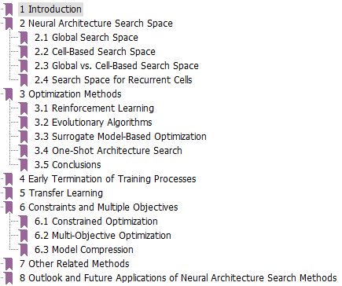 | 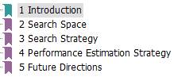  |

## Neural Architecture Search (NAS)

|      Type   |        G       |                  RL    |            EA           |        PD              |    Other   |
|:------------|:--------------:|:----------------------:|:-----------------------:|:----------------------:|:----------:|
| Explanation | gradient-based | reinforcement learning | evaluationary algorithm | performance prediction | other types |

### 2020

|  Title  |   Venue  |  Challenge  |  Search Space  |   Type   |   Datasets   |   Other Skills   |   Code   |
|:--------|:--------:|:---------|:--------:|----------|----------|----------|----------|
| [When NAS Meets Robustness: In Search of Robust Architectures against Adversarial Attacks](When NAS Meets Robustness.pdf) | CVPR | 使用NAS来研究如何提高深度学习网络模型的鲁棒性 | Cell-Based | G | CIFAR, SVHN, Tiny-ImageNet, ImageNet |  | [Github](https://github.com/gmh14/RobNets) |
| [Block-wisely Supervised Neural Architecture Search with Knowledge Distillation](https://www.xiaojun.ai/papers/CVPR2020_04676.pdf) | CVPR | 区别于现有（RL，Darts，One-shot）的神经网络搜索算法，*作者基于知识蒸馏的思想，引入教师模型来引导网络**结构搜索**的方向*。利用来自教师模型不同深度的监督信息，将原本端到端的网络搜索空间在深度上分块，*实现对网络搜索空间独立**分块**的**权重**共享训练，大大降低了**权重**共享带来的干扰*。在不牺牲权重共享的高效率的同时，也保证了对候选子模型的评估准确性，同时通过算法实现对搜索空间中所有候选结构的遍历 | 权重共享 | G |  |  | [Github](https://github.com/changlin31/DNA) |
| [Overcoming Multi-Model Forgetting in One-Shot NAS with Diversity Maximization](https://www.xiaojun.ai/papers/cvpr-2020-zhang.pdf) | CVPR | 对权重共享机制进行改进。解决超网络训练过程中训练新网络导致旧网络性能下降的问题（即多模型遗忘问题），将one-shot NAS中的超网训练描述为一个持续学习的约束优化问题，即当前体系结构的学习不应该降低以前体系结构的性能。 | 权重共享 | G |  |  | [Github](https://github.com/MiaoZhang0525/NSAS_FOR_CVPR) |
| [Densely Connected Search Space for More Flexible Neural Architecture Search](https://arxiv.org/abs/1906.09607) | CVPR | 重构搜索空间。构建密集连接的搜索空间，能够自动搜索网络的宽度 | 重构搜索空间 | G |  |  | [Github](https://github.com/JaminFong/DenseNAS) |
| [EfficientDet: Scalable and Efficient Object Detection](https://arxiv.org/abs/1911.09070) | CVPR | 做目标检测的，不觉得是NAS |  | RL |  |  | - |
| [NAS-BENCH-102: Extending the Scope of Reproducible Neural Architecture Search](https://openreview.net/forum?id=HJxyZkBKDr) | ICLR | 提出NAS-BENCH-201，作为NAS的基准算法的评价平台 |  | 一个总结性的工作- |  |  | [Github](https://github.com/D-X-Y/AutoDL-Projects) |
| [Understanding Architectures Learnt by Cell-based Neural Architecture Search](https://openreview.net/pdf?id=H1gDNyrKDS) | ICLR |  | 基于cell | G |  |  | [GitHub](https://github.com/automl/RobustDARTS) |
| [Evaluating The Search Phase of Neural Architecture Search](evaluating_the_search_phase_of_neural_architecture_search.pdf) | ICLR | 提出权重共享策略降低候选NAS框架的排名，导致不能反映它们真实的性能，降低了搜索过程的效率 | 权重共享 | - |  |  | |
| [AtomNAS: Fine-Grained End-to-End Neural Architecture Search](https://openreview.net/forum?id=BylQSxHFwr) | ICLR | 提出一个由原子组成的细粒度搜索空间 不再是搜索再训练而是同时搜索训练 | 重构搜索空间，加速训练过程 | | | | [GitHub](https://github.com/meijieru/AtomNAS) |
| [Fast Neural Network Adaptation via Parameter Remapping and Architecture Search](https://openreview.net/forum?id=rklTmyBKPH) [笔记](#FAST NEURAL NETWORK ADAPTATION VIA PARAMETER REMAPPING AND ARCHITECTURE SEARCH（ICLR20）) | ICLR | 从一个设计好的人工网络开始，对其进行拓展得到super network，然后做架构自适应得到目标架构，然后做参数自适应得到目标网络。使用了参数重映射。 | 模型重用 | - |  |  | [GitHub](https://github.com/JaminFong/FNA) |
| [Once for All: Train One Network and Specialize it for Efficient Deployment](https://openreview.net/forum?id=HylxE1HKwS) [笔记](#ONCE-FOR-ALL: TRAIN ONE NETWORK AND SPECIALIZE IT FOR EFFICIENT DEPLOYMENT ON DIVERSE HARDWARE PLATFORMS  （ICLR20）) | ICLR | 子网络之间相互共享权重，为了避免子网络之间相互影响，提出渐进收缩算法。 | 权重共享 | G |  |  | [GitHub](https://github.com/mit-han-lab/once-for-all) |
| Efficient Transformer for Mobile Applications | ICLR | 看不到相应的论文 |  | - |  |  | - |
| [PC-DARTS: Partial Channel Connections for Memory-Efficient Architecture Search](PC-DARTS.pdf) [笔记](#PC-DARTS: Partial Channel Connections for Memory-Efficient Architecture Search（ICLR20）) | ICLR | 为了减少内存的消耗，对通道进行采样（1/k），只对部分通道进行卷积.**边正则化**：缓解上述的“部分通道连接”操作会带来一些训练不稳定的问题 | 梯度策略 | G |  |  | [GitHub](https://github.com/yuhuixu1993/PC-DARTS) |
| Adversarial AutoAugment [可参考](https://zhuanlan.zhihu.com/p/102362726?utm_source=wechat_session) | ICLR | 使用NAS做数据增强 |  | - |  |  | - |
| [NAS evaluation is frustratingly hard](NAS EVALUATION IS FRUSTRATINGLY HARD.pdf) [可参考](#https://blog.csdn.net/dwilimeth/article/details/103793818) | ICLR | 对8种NAS方法在5个数据集上分别与随机搜索架构的实验结果进行对比，实验表明各种搜索策略效果较小，而搜索空间和各种trick与初始参数对模型的性能影响较大。 |  | - |  |  | [GitHub](https://github.com/antoyang/NAS-Benchmark) |
| [FasterSeg: Searching for Faster Real-time Semantic Segmentation](https://openreview.net/pdf?id=BJgqQ6NYvB) [可参考](https://zhuanlan.zhihu.com/p/98956382) | ICLR | 为实时的语义分割任务设计搜索空间 |  | G |  |  | [GitHub](https://github.com/TAMU-VITA/FasterSeg) |
| [Computation Reallocation for Object Detection](https://openreview.net/forum?id=SkxLFaNKwB) [可参考](https://zhuanlan.zhihu.com/p/136030210) | ICLR | 在目标检测任务中使用NAS的方法对计算资源进行再分配，它可以在目标检测数据集上直接学习跨不同特征分辨率和空间位置的计算重新分配策略。提出了用于阶段和空间重新分配的两级重新分配空间。采用一种新颖的**分层搜索程序**来应对复杂的搜索空间。 |  | - |  |  | - |
| Towards Fast Adaptation of Neural Architectures with Meta Learning | ICLR | 看不到论文 |  | - |  |  | - |
| [AssembleNet: Searching for Multi-Stream Neural Connectivity in Video Architectures](./20-ICLR-ASSEMBLENET.pdf) | ICLR | 使用NAS做视频理解的。视频CNN解释为一个相互连接的多流卷积块的集合，自动寻找具有更好的连通性和时空交互的神经结构来进行视频理解的方法。 | 其他 | EA |  |  | - |
| How to Own the NAS in Your Spare Time | ICLR | 一眼看不懂 |  | - |  |  | - |

### 2019

|    |  Title  |   Venue  |   Type   | Challenge  |   Code   |
|:--------|:--------:|:--------:|:--------:|:--------:|:--------:|
| 1 | [DATA: Differentiable ArchiTecture Approximation](http://papers.nips.cc/paper/8374-data-differentiable-architecture-approximation) | NeurIPS | 梯度优化- |  | - |
|  | [Random Search and Reproducibility for Neural Architecture Search](./19-UAI-Random Search and Reproducibility for Neural Architecture Search.pdf) | UAI | G | 提出可以将随机搜索得到的框架作为NAS对比的基线。并且指出有权值共享的随机搜索架构优于早期停止的随即搜索架构 | [GitHub](https://github.com/D-X-Y/NAS-Projects/blob/master/scripts-search/algos/RANDOM-NAS.sh) |
|  | [Improved Differentiable Architecture Search for Language Modeling and Named Entity Recognition](https://www.aclweb.org/anthology/D19-1367.pdf/) | EMNLP | 梯度优化G |  | - |
|  | [Continual and Multi-Task Architecture Search](./19-acl-Continual and Multi-Task Architecture Search.pdf) | ACL | cell、RL |  | - |
|  | Progressive Differentiable Architecture Search: Bridging the Depth Gap Between Search and Evaluation | ICCV | 梯度优化- |  | - |
|  | [Searching for MobileNetV3](./19-iccv-Searching for MobileNetV3.pdf) | ICCV | EA | 本文开始探讨自动搜索算法和网络设计如何协同工作，利用互补的方法来提高整体水平。 | - |
|  | [Multinomial Distribution Learning for Effective Neural Architecture Search](./19-ICCV-Zheng_Multinomial_Distribution_Learning_for_Effective_Neural_Architecture_Search_ICCV_2019_paper.pdf) | ICCV | - | 提出一种学习多项式分布的优化方法 | [GitHub](https://github.com/tanglang96/MDENAS) |
|  | FPNASNet:[Fast and Practical Neural Architecture Search](./19-ICCV-Cui_Fast_and_Practical_Neural_Architecture_Search_ICCV_2019_paper.pdf) | ICCV | global | 我们的方法是搜索整个网络架构，以保证块的多样性，而不是重复堆积一组相似的块。我们将搜索过程建模为一个双层优化问题，并提出一个近似解。 | |
|  | [Teacher Guided Architecture Search](./19-iccv-Bashivan_Teacher_Guided_Architecture_Search_ICCV_2019_paper.pdf) | ICCV | cell | 使用教师网络指导搜索的过程，搜索速度提升，与[Progressive Neural Architecture Search](./18-eccv-Chenxi_Liu_Progressive_Neural_Architecture_ECCV_2018_paper.pdf)相关 | - |
| 10 | [AutoDispNet: Improving Disparity Estimation With AutoML](./19-iccv-Saikia_AutoDispNet_Improving_Disparity_Estimation_With_AutoML_ICCV_2019_paper.pdf) | ICCV | cell,G | 我们展示了如何使用和扩展现有的自动化技术，以有效地优化大规模的类似于u - net的编解码器架构。特别地，我们利用基于梯度的神经结构搜索和贝叶斯优化来进行超参数搜索。 | - |
|  | [Resource Constrained Neural Network Architecture Search: Will a Submodularity Assumption Help?](./19-iccv-Xiong_Resource_Constrained_Neural_Network_Architecture_Search_Will_a_Submodularity_Assumption_ICCV_2019_paper.pdf) | ICCV | EA | 将计算资源限制考虑到优化目标中 | - |
|  | [One-Shot Neural Architecture Search via Self-Evaluated Template Network](https://arxiv.org/abs/1910.05733) | ICCV | 权重共享G |  | [Github](https://github.com/D-X-Y/NAS-Projects) |
|  | [Evolving Space-Time Neural Architectures for Videos](./19-iccv-Evolving Space-Time Neural Architectures for Videos.pdf) | ICCV | cell,EA | 为视频任务设计搜索空间 | [GitHub](https://sites.google.com/view/evanet-video) |
|  | [AutoGAN: Neural Architecture Search for Generative Adversarial Networks](./19-iccv-AutoGAN.pdf) | ICCV | RL | global，针对GAN任务使用不同的RNN控制器生成每个cell（即），引入参数共享动态重置策略来加速训练 | [github](https://github.com/TAMU-VITA/AutoGAN) |
|  | [Discovering Neural Wirings](./19-NeurIPS-Discovering Neural Wirings.pdf) | NeurIPS | G | 提出了一种发现神经线路的方法。我们放松了层的典型概念，使通道能够形成相互独立的连接。 | [Github](https://github.com/allenai/dnw) |
|  | [Towards modular and programmable architecture search](./19-NeurIPS-Towards modular and programmable architecture.pdf) | NeurIPS | [Other](https://github.com/D-X-Y/Awesome-NAS/issues/10) | 提出了一种形式化的语言来编码一般计算图形上的搜索空间 | [Github](https://github.com/negrinho/deep_architect) |
| 17 | [Network Pruning via Transformable Architecture Search](./19-NeurIPS-Network Pruning viaTransformable Architecture Search.pdf) | NeurIPS | G | 通过可转移的架构搜索进行网络剪枝，参数共享 | [Github](https://github.com/D-X-Y/NAS-Projects) |
|  | [Deep Active Learning with a NeuralArchitecture Search](./19-NeurIPS-Deep Active Learning with a Neural ArchitectureSearch.pdf) | NeurIPS | - | 提出了一种新的主动学习策略，即学习算法在主动学习的同时动态搜索有效的架构 | - |
|  | [DetNAS: Backbone Search for Object Detection](./19-NeurIPS-detnas-backbone-search-for-object-detection.pdf) | NeurIPS | - | 采用one-shot架构，为目标检测搜索骨干网络 | - |
| 20 | SpArSe: Sparse Architecture Search for CNNs on Resource-Constrained Microcontrollers | NeurIPS | - | 性能与效率平衡 | - |
|  | [Efficient Forward Architecture Search ](./19-NeurIPS-Efficient Forward Architecture Search.pdf) | NeurIPS | G,不确定 | 允许模型在训练和从现有架构和权重开始的热身过程中增加复杂性 | [Github](https://github.com/microsoft/petridishnn) |
|  | [Efficient Neural Architecture Transformation Search in Channel-Level for Object Detection](./9576-efficient-neural-architecture-transformation-search-in-channel-level-for-object-detection.pdf) | NeurIPS | G，目标检测 |  | - |
|  | [XNAS: Neural Architecture Search with Expert Advice](8472-xnas-neural-architecture-search-with-expert-advice.pdf) | NeurIPS | 梯度优化，G |  | - |
|  | [Neural architecture search: A survey](http://www.jmlr.org/papers/volume20/18-598/18-598.pdf) | JMLR | Survey |  | - |
|  | [DARTS: Differentiable Architecture Search](./19-iclr-DARTS DIFFERENTIABLE ARCHITECTURE SEARCH.pdf) | ICLR | G | 将离散的搜索空间进行连续化,使用梯度的方法进行优化 | [github](https://github.com/quark0/darts) |
|  | [ProxylessNAS: Direct Neural Architecture Search on Target Task and Hardware](proxylessnas_direct_neural_architecture_search_on_target_task_and_hardware.pdf) | ICLR | RL/G | 没有代理任务，直接在目标任务上进行搜索训练。基于平台 | [github](https://github.com/MIT-HAN-LAB/ProxylessNAS) |
|  | [Graph HyperNetworks for Neural Architecture Search](https://arxiv.org/pdf/1810.05749.pdf) | ICLR | G，参数共享 |  | - |
|  | [Learnable Embedding Space for Efficient Neural Architecture Compression](LEARNABLE EMBEDDING SPACE FOR.pdf) | ICLR |                          Other                          | 网络架构压缩 | [github](https://github.com/Friedrich1006/ESNAC) |
|  | [Efficient Multi-Objective Neural Architecture Search via Lamarckian Evolution](EFFICIENT MULTI-OBJECTIVE NEURAL ARCHITEC.pdf) | ICLR | EA | 多目标优化 | - |
| 30 | [SNAS: stochastic neural architecture search](https://openreview.net/pdf?id=rylqooRqK7) | ICLR | 过，G | 引用过 | - |
|  | [Searching for A Robust Neural Architecture in Four GPU Hours](http://xuanyidong.com/publication/gradient-based-diff-sampler/) | CVPR | 过，G | 引用过 | [Github](https://github.com/D-X-Y/NAS-Projects) |
|  | [ChamNet: Towards Efficient Network Design through Platform-Aware Model Adaptation](http://openaccess.thecvf.com/content_CVPR_2019/papers/Dai_ChamNet_Towards_Efficient_Network_Design_Through_Platform-Aware_Model_Adaptation_CVPR_2019_paper.pdf) | CVPR | - | 基于平台的 | - |
|  | [Partial Order Pruning: for Best Speed/Accuracy Trade-off in Neural Architecture Search](Li_Partial_Order_Pruning_For_Best_SpeedAccuracy_Trade-Off_in_Neural_Architecture_CVPR_2019_paper.pdf) | CVPR | EA | 平衡速度和精度 | [github](https://github.com/lixincn2015/Partial-Order-Pruning) |
|  | [FBNet: Hardware-Aware Efficient ConvNet Design via Differentiable Neural Architecture Search](https://arxiv.org/abs/1812.03443) | CVPR | G | 基于DARTS的改进 | - |
|  | [RENAS: Reinforced Evolutionary Neural Architecture Search	](Chen_RENAS_Reinforced_Evolutionary_Neural_Architecture_Search_CVPR_2019_paper.pdf) | CVPR | G |  | - |
|  | [Auto-DeepLab: Hierarchical Neural Architecture Search for Semantic Image Segmentation](https://arxiv.org/pdf/1901.02985.pdf) | CVPR |  G | 过 | [GitHub](https://github.com/tensorflow/models/tree/master/research/deeplab) |
|  | [MnasNet: Platform-Aware Neural Architecture Search for Mobile](https://arxiv.org/abs/1807.11626) | CVPR | RL | 与平台相关的 | [Github](https://github.com/AnjieZheng/MnasNet-PyTorch) |
|  | [MFAS: Multimodal Fusion Architecture Search](https://arxiv.org/pdf/1903.06496.pdf) | CVPR | EA | 多model融合 | - |
|  | [A Neurobiological Evaluation Metric for Neural Network Model Search](Blanchard_A_Neurobiological_Evaluation_Metric_for_Neural_Network_Model_Search_CVPR_2019_paper.pdf) | CVPR | Other | 提出一个NAS的指标 | - |
| 40 | [Fast Neural Architecture Search of Compact Semantic Segmentation Models via Auxiliary Cells](https://arxiv.org/abs/1810.10804) | CVPR | RL | 语义分割 | - |
|  | Customizable Architecture Search for Semantic Segmentation | CVPR | - | 语义分割 | - |
|  | [Regularized Evolution for Image Classifier Architecture Search](https://arxiv.org/pdf/1802.01548.pdf) | AAAI | EA | 过 | - |
|  | AutoAugment: Learning Augmentation Policies from Data | CVPR | RL | 数据增强 | - |
|  | [Population Based Augmentation: Efficient Learning of Augmentation Policy Schedules](Population Based Augmentation Efficient Learning of Augmentation Policy Schedules.pdf) | ICML | EA |  | - |
|  | [The Evolved Transformer](https://arxiv.org/pdf/1901.11117.pdf) | ICML | EA |  | [Github](https://github.com/tensorflow/tensor2tensor/blob/master/tensor2tensor/models/evolved_transformer.py) |
|  | EfficientNet: Rethinking Model Scaling for Convolutional Neural Networks | ICML | RL | 模型的放缩 | - |
|  | [NAS-Bench-101: Towards Reproducible Neural Architecture Search](https://arxiv.org/abs/1902.09635) | ICML | Other |  | [Github](https://github.com/google-research/nasbench) |

### 2018
|  Title  |   Venue  |  Challenge  |  时间  |  Search Space  |   Type   |   Dataset   |   Other Skills   |   Code   |
|:--------|:--------:|:--------:|:--------:|----------|----------|----------|----------|----------|
| Towards Automatically-Tuned Deep Neural Networks | BOOK |  |  |  | - |  |  | [GitHub](https://github.com/automl/Auto-PyTorch) |
| [Efficient Architecture Search by Network Transformation](https://arxiv.org/pdf/1707.04873.pdf) | AAAI | 不再从头开始搜索并训练网络，而是基于已有的网络进行net transformation，重用权重来实现高效网络的发掘，主要包括扩展层和加深层两个操作 | 10 gpu days | 模型重用，重用权重 | RL |  |  | [github](https://github.com/han-cai/EAS) |
| [Learning Transferable Architectures for Scalable Image Recognition](http://openaccess.thecvf.com/content_cvpr_2018/papers/Zoph_Learning_Transferable_Architectures_CVPR_2018_paper.pdf) | CVPR | 由之前的直接搜索整个框架转而**搜索两个cell**（nermal，reduction  cell），来降低计算量。使用500GPU跑了4天 | 2000 GPU days | cell,cell由此提出 | RL，cell |  |  | [github](https://github.com/tensorflow/models/tree/master/research/slim/nets/nasnet) |
| [N2N learning: Network to Network Compression via Policy Gradient Reinforcement Learning](https://openreview.net/forum?id=B1hcZZ-AW) | ICLR | 使用RL在现有的网络上进行**网络模型的压缩**，主要包括层的移除与层的压缩两个操作 |  | 模型重用 | RL |  |  | - |
| [A Flexible Approach to Automated RNN Architecture Generation](https://openreview.net/forum?id=SkOb1Fl0Z) | ICLR | 使用RL来更加灵活的自动化生成RNN |  | global | RL/PD |  |  | - |
| [Practical Block-wise Neural Network Architecture Generation](http://openaccess.thecvf.com/content_cvpr_2018/papers/Zhong_Practical_Block-Wise_Neural_CVPR_2018_paper.pdf) | CVPR | 使用Q-learning搜索block，通过拼接得到最佳的网络结构，大大降低了搜索空间 | 96 GPU days | cell | RL |  |  | - |
| [Path-Level Network Transformation for Efficient Architecture Search](https://arxiv.org/abs/1806.02639) | ICML | 对连接的**路径级别的网络**进行修改，而不仅仅是层级别的 | 10 GPU days | 模型重用（reused trained networks），权重重用 | RL |  |  | [github](https://github.com/han-cai/PathLevel-EAS) |
| [Hierarchical Representations for Efficient Architecture Search](./18-iclr-hierarchical_representations_for_efficient_architecture_search.pdf) | ICLR | 提出网络结构的**层级表示**，使用进化算法学习cell，堆叠 |  | 基于cell | EA |  |  | - |
| [Understanding and Simplifying One-Shot Architecture Search](http://proceedings.mlr.press/v80/bender18a/bender18a.pdf) | ICML | 理解weight sharing的机制和原理 |  | 我更偏向于认为它是Global，权重共享 | G，one-shot | CIFAR-10，ImageNet | One-Shot，筛选候选架构，然后从头开始训练 | - |
| [SMASH: One-Shot Model Architecture Search through HyperNetworks](https://arxiv.org/pdf/1708.05344.pdf) | ICLR | 将节点之间的操作视为一种内存读取机制，将编码向框架结构之间建立映射（没看懂），为上面一篇论文的one-shot模型做铺垫 |  | 参数共享 | G，one-shot |  |  | [github](https://github.com/ajbrock/SMASH) |
| [Neural Architecture Optimization](https://arxiv.org/pdf/1808.07233.pdf) | NeurIPS | 提出将离散的模型框架通过编码器映射到网络的连续表示上,通过梯度的方法进行优化,最后再通过解码器将连续的表示进行离散化 |  |  | G,基于梯度 |  |  | [github](https://github.com/renqianluo/NAO) |
| [Searching for efficient multi-scale architectures for dense image prediction](https://papers.nips.cc/paper/8087-searching-for-efficient-multi-scale-architectures-for-dense-image-prediction.pdf) | NeurIPS | 将之前的NAS从图像分类任务转移到密集图像预测任务上(图像的语义分割,具有高分辨率的图像上), 为该任务设计了特定的搜索空间, 使用随机算法进行搜索,并重新设计代理任务 |  |  | Other |  |  | - |
| [Progressive Neural Architecture Search](http://openaccess.thecvf.com/content_ECCV_2018/papers/Chenxi_Liu_Progressive_Neural_Architecture_ECCV_2018_paper.pdf) [笔记](#Progressive Neural Architecture Search (ECCV'18)) | ECCV | 学习cell结构, 从简单到复杂的方式**渐进地**学习一个cell结构, 通过拼接得到最终的模型, 对于候选模型的评估采用学习的预测函数进行预测, 得到候选模型的排序 |  | cell | PD |  |  | [github](https://github.com/chenxi116/PNASNet) |
| [Neural Architecture Search with Bayesian Optimisation and Optimal Transport](Neural architecture search with bayesian optimisation and optimal transport.pdf) | NeurIPS |  |  | 贝叶斯优化 | Other |  |  | [github](https://github.com/kirthevasank/nasbot) |
| [Differentiable Neural Network Architecture Search](https://openreview.net/pdf?id=BJ-MRKkwG) | ICLR-W |  |  | 基于梯度 | G |  |  | - |
| [Accelerating Neural Architecture Search using Performance Prediction](https://arxiv.org/abs/1705.10823) | ICLR-W |  |  | 性能预测 | PD |  |  | - |
| Efficient Neural Architecture Search via Parameter Sharing | ICML | 提出通过权重共享提升搜索效率 |  | 参数共享 |  | | |  |
| DPP-Net: Device-aware Progressive Search for Pareto-optimal Neural Architectures |  | 平台感知 | |  | | | | |

### 2017
|  Title  |   Venue  | challenge  | 时间 | 亮点 |   Type   |   Code   |
|:--------|:--------:|:--------:|:--------:|:--------:|----------|----------|
| [Neural Architecture Search with Reinforcement Learning](./17-iclr-Neural Architecture Search with Reinforcement Learning.pdf) | ICLR | 将模型的框架视为一系列变长的string，使用RNN作为控制器来生成string作为对应的architecture，把acc作为奖励，通过更新RNN的参数θ来调整最优模型的选择。对整个architecture进行搜索，**24000 GPU days** | 800个gpu一个月 | 将RNN作为控制器生成网络框架 的描述string | RL，global | - |
| [Designing Neural Network Architectures using Reinforcement Learning](https://openreview.net/pdf?id=S1c2cvqee) | ICLR | 将框架的选择视为一个马尔卡弗决策过程，通过使用Q-learning来选择框架，**100 GPU days** | 10个GPU运行8-10dayes | 提出的预定义的行为分布极为接近目前常用的超级网络结构图 | RL,global | - |
| Large-scale evolution of image classifiers [笔记](#Large-Scale Evolution of Image Classifiers (ICML'17)) | ICML | 提出一个大规模进化算法，从向一个最简单的DAG中逐步添加操作来变异得到新的网络，尽量减少人为干预。 | | 从一个非常简单的结构出发进行进化搜索，但需要消耗大量的计算量 | EA |  |
| [Neural Optimizer Search with Reinforcement Learning](http://proceedings.mlr.press/v70/bello17a/bello17a.pdf) | ICML | 这个是与Neural Architecture Search with Reinforcement Learning采用类似的RNN控制器来搜索一个新的权重更新数学方程，可参考https://blog.csdn.net/qq_32256033/article/details/88605861 |  | 将NAS 的方法应用在优化算法上 | RL | - |
| [Learning Curve Prediction with Bayesian Neural Networks](http://ml.informatik.uni-freiburg.de/papers/17-ICLR-LCNet.pdf) | ICLR | 使用Bayesian neural network对学习曲线进行建模与预测 |  |  | PD | - |
| [Hyperband: A Novel Bandit-Based Approach to Hyperparameter Optimization](https://arxiv.org/abs/1603.06560) | ICLR | 提出Hyperband算法，这是一个超参数优化问题，[可参考](https://www.cnblogs.com/marsggbo/p/10161605.html) |  |  | PD | - |
| [Hyperparameter Optimization: A Spectral Approach](https://arxiv.org/abs/1706.00764) | NeurIPS-W | 是一个超参数优化问题，[可参考](https://zhuanlan.zhihu.com/p/27555858) |  |  | Other | [github](https://github.com/callowbird/Harmonica) |
| Learning to Compose Domain-Specific Transformations for Data Augmentation | NeurIPS | 无 |  |  | - | - |
| Evolving deep neural networks | CoRR | 无 | | | EA |  |
| Genetic CNN[笔记](#Genetic CNN(ICCV'17)) | ICCV | 对网络的结构进行编码，将编码作为网络的DNA，之后对该段编码进行变异（修改其中某位编码）或交叉得到新的网络结构 | | | EA |  |

### 2012-2016
|  Title  |   Venue  |   Type   |   Code   |
|:--------|:--------:|:--------:|:--------:|
| [Speeding up Automatic Hyperparameter Optimization of Deep Neural Networksby Extrapolation of Learning Curves](http://ml.informatik.uni-freiburg.de/papers/15-IJCAI-Extrapolation_of_Learning_Curves.pdf) | IJCAI'18 | PD | [github](https://github.com/automl/pylearningcurvepredictor) |

### arXiv
|  Title  |   Date  |  challenge  |   Type   |   Code   |
|:--------|:--------:|:--------:|:--------:|:--------:|
| [Population Based Training of Neural Networks](https://arxiv.org/abs/1711.09846) | 2017.11 | 结合并行搜索和序列优化的优点形成PBT算法对网络的**超参数**进行调优 | EA | - |
| [NSGA-NET: A Multi-Objective Genetic Algorithm for Neural Architecture Search](https://arxiv.org/pdf/1810.03522.pdf) | 2018.10 |  | EA | - |
| [Training Frankenstein’s Creature to Stack: HyperTree Architecture Search](https://arxiv.org/pdf/1810.11714.pdf) | 2018.10 |  | G | - |
| [Fast, Accurate and Lightweight Super-Resolution with Neural Architecture Search](https://arxiv.org/pdf/1901.07261.pdf) | 2019.01 |  | G | [github](https://github.com/falsr/FALSR) |

# Paper Details

## RL在NAS上开创性的两篇工作

### NEURAL ARCHITECTURE SEARCH WITH REINFORCEMENT LEARNING (ICLR'17)

> 使用强化学习的一个NAS的开创性工作
>
> **将NN网络模型的描述表述为一系列变长的string**，使用RNN作为控制器来生成这种string

#### RL与NAS 的结合

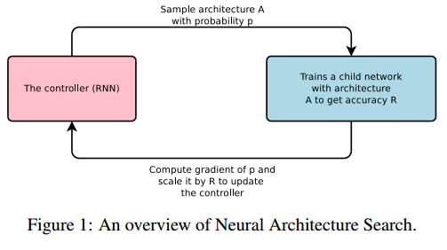

> - controller（RNN）：相当于agent，生成框架A（相当于做出一个动作）
> - 蓝色框：相当于是一个环境E，对动作做出反馈，即当前框架A的acc作为reward
> - 调整controller：将acc作为反馈信号，调整controller，做出新的动作

#### 使用RNN控制器生成模型框架的参数：

> - 包括kernal size, step, channel
> - 上一个RNN生成的参数作为下一个RNN的输入

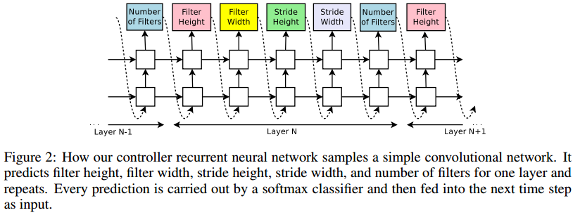

#### RNN控制器参数的更新

> 通过更新控制器RNN的参数θ来调整生成的模型框架

### DESIGNING NEURAL NETWORK ARCHITECTURES USING REINFORCEMENT LEARNING （ICLR'17）

>  将框架的选择视为一个马尔卡弗决策的过程，使用Q-learning来记录奖励，获得最优的网络框架

#### Designing CNN Architectures with Q-learning

##### 使用RL进行NAS的整体的流程：

> - 预定一个整体的网络框架
> - 从中采样一个网络的拓扑结构
> - 将拓扑的信息和性能表现进行存储
> - angent通过Q-learning，利用自己的memory学习CNN的拓扑

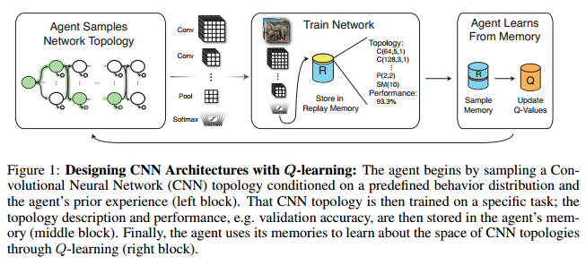

##### Q-learning中Q值的更新

> https://www.jianshu.com/p/dc79f9e43a1d

#### Markov Decision Process for CNN Architecture Generation 

> 此方法也是非常耗时，对于每个数据集，作者使用10块GPU训练了8-10天。

## When NAS Meets Robustness: In Search of Robust Architectures against Adversarial Attacks  （2020CVPR）

### Abstract  

是为了寻找健壮鲁棒的深度网络模型，采用NAS的方法生产大量可用于评估的网络框架。

> Our “robust architecture Odyssey” reveals several valuable observations: 
>
> 1) **densely connected patterns result in improved robustness**; 密集连接有助于提升网络模型的鲁棒性
>
> 2) under computational budget, adding convolution operations to direct connection edge is effective;计算资源有限的情况下，直连边的卷积操作是有效的，相较下的是跳跃连接。
>
> 3) flow of solution procedure (FSP) matrix is a good indicator of network robustness.  

### Search Space

> 基本沿用和DARTS相似的有向无环图的设计思路：
>
> - 每个cell将前两个cell 的输出作为输入
> - cell的输出等于cell内中间节点的拼接
>
> 不同的是：
>
> - 不在限制两个节点之间的连接个数（即操作数），增加可供搜索的architecture的丰富度；
> - 没有看到不同操作的权重赋值，而是直接对其进行了加和。搜索方法采用的是典型的one-shot model 的方法。

### cell-based的architecture鲁棒性分析

> （a）对supernet进行PGD的对抗性训练，采样1000个子网络，在验证集微调前后的性能对比，对子网络进行对抗性微调有助于性能的提升（更加具有针对性）
>
> （b）绘制微调后子网络的性能直方图，**猜测鲁棒性好的网络框架拥有相似的网络结构**

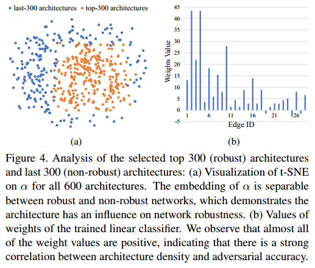

> （a）对robust和non-robust的框架参数α使用t-SNE进行降维可视化，发现二者明显可分。
>
> （b）使用一个线性分类器对这个600个框架进行分类的权重进行可视化，权重几乎都为正数，表明框架的连接密度对健壮性有很强的相关性。

于是进一步定义框架密度D，并探究其与模型的健壮性之间的关系：

> 以此说明密集连接有助于提升框架的鲁棒性。

### 固定预算下的架构搜索

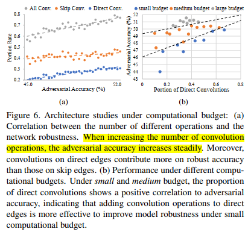

> 1）直连边上的卷积比跳跃边上的卷积对架构的鲁棒性更加有效
>
> 2）小预算情况下直连边上的卷积可以有效提高架构的鲁棒性，大预算下猜测是密集连接主导了模型的鲁棒性。

## Undestanding and Simplifying One-Shot Architecture Search  （2018ICML）

### Example of a cell during one-shot model evaluation

### Diagram of the one-shot architecture  

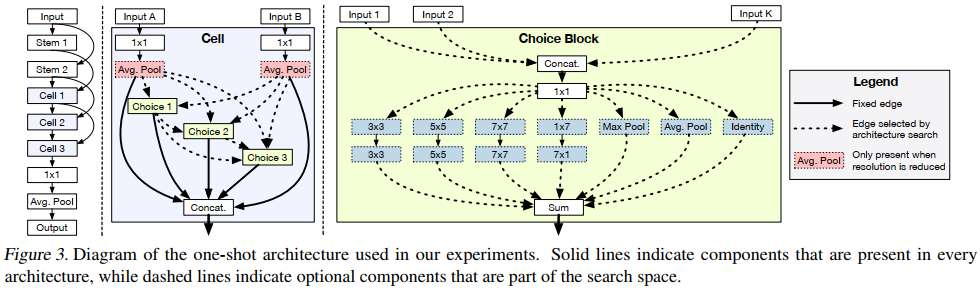

### Understanding One-Shot Models  

> 当我们从stand-alone转向one-shot model时，虽然最佳模型的准确性仅下降5 - 10个百分点，但前景较差的架构的准确性下降了60个百分点。

> 作者认为**神经网络架构搜索能够找到哪些操作是有效的**，如果这些有效操作存在于模型中，那么就可以预测这些架构的准确率很高，如果他们不存在模型中，所以就预测他们的准确率很低。
>
> Removing the less important operations from the network has relatively little influence on the model’s predictions and only a modest effect on its final prediction accuracy. 
>
> Removing the most important operations from the network, however, can lead to dramatic changes in the model’s predictions and a large drop in prediction accuracy.  

>为了验证上述实验的假设，作者设计了一个新的实验：
>
>使用对称的**KL散度**来评估搜索出的模型和ALL ON模型（即保留大量路径基本不削减）的预测分布，结果如下图所示。作者发现，表现好的One-Shot模型和ALL ON模型的对称KL散度低，即这两者的预测很接近，这些One-Shot模型的验证集准确率也高。作者认为这表明权重共享会使得One-Shot模型专注于最有效的操作.

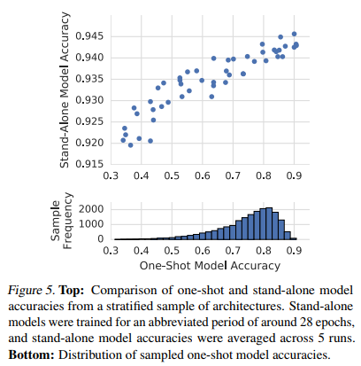

## Population Based Training of Neural Networks （2017）

> 提出了一种新的超参数的优化方法：结合并行搜索与序列优化进行探索最有的超参数。

### PBT与SO和PS的对比示意图

>如图所示，(a)中的序列优化过程只有一个模型在不断优化，消耗大量时间。(b)中的并行搜索可以节省时间，但是相互之间没有任何交互，不利于信息利用。(c)中的PBT算法结合了二者的优点。
>  首先PBT算法随机初始化多个模型，每训练一段时间设置一个检查点(checkpoint)，然后根据其他模型的好坏调整自己的模型。若自己的模型较好，则继续训练。若不好，则替换(exploit)成更好的模型参数，并添加随机扰动(explore)再进行训练。其中checkpoint的设置是人为设置每过多少step之后进行检查。扰动要么在原超参数或者参数上加噪声，要么重新采样获得。

#### PBT的伪算法

> θ：当前框架的可训练的参数
>
> h：当前框架的超参数，相当于确定了模型的框架结构
>
> p：性能评价
>
> t：训练的步骤数

### 效果展示

- **GAN & RL**
    左边的gif是GAN在CIFAR-10上的效果，右边是Feudal Networks(FuN)在 Ms Pacman上的效果。

  

> 图中红色的点是随机初始化的模型，也就是所谓的population。再往后，黑色的分支就是效果很差的模型，被淘汰掉。蓝色的分支表示效果一直在提升的模型，最终得到的蓝色点就是最优的模型。不得不说，DeepMind这可视化效果做的，真的强。

## Efficient Architecture Search by Network Transformation (AAAI'18)

> 不再从零开始对网络进行搜索和训练，基于net2net的net transformation对现有的网络进行修改，使用RL来决定要采用哪种transformation操作

### Overview

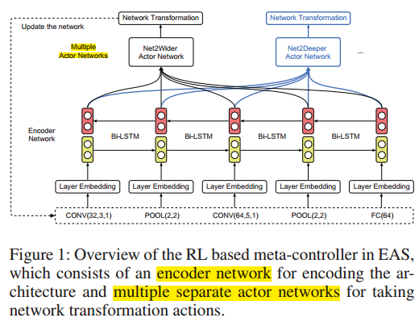

> 主要包括：
>
> - 对现有网络架构进行编码的encoder network，获得体系结构的低维表示
> - 决定采用哪种transformation action类别的多actor networks

### Actor Networks 

| Net2Wider Actor                                         | Net2Deeper Actor                                        |
| ------------------------------------------------------- | ------------------------------------------------------- |
| 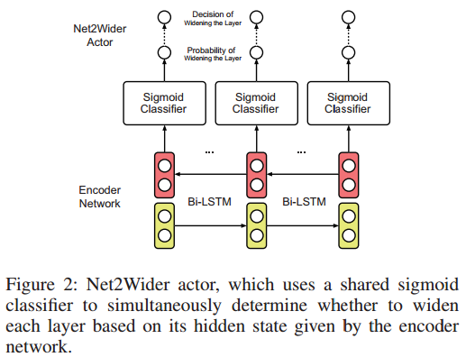 |  |

>- Net2Wider Actor：用来决定是否对网络的每一层进行扩展
>- Net2Deeper Actor：决定是否对网络继续加深，即插入层数的位置与插入层的尺寸

## N2N learning: Network to Network Compression via Policy Gradient Reinforcement Learning （ICLR'18）

> 使用RL的方法来压缩网络模型，主要包含两个操做：
>
> - 移除层
> - 压缩层参数

### Overview

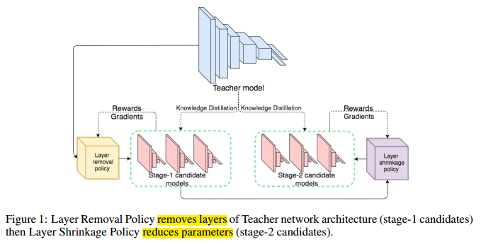

>通过一个两阶段的方法来压缩网络模型：
>
>1. first selects a macro-scale “layer removal” action,宏观角度上的层移除
>2. followed by a micro-scale “layer shrinkage” action,微观角度上的层压缩操作
>
>最后使用知识蒸馏的方法来训练产生的候选网络。

### 两个阶段所采用的网络结构

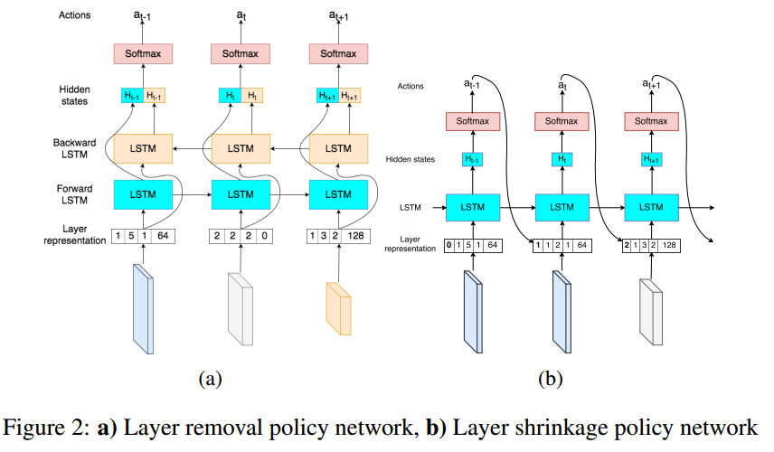

### 结果

> ResNet-34上实现了10倍的压缩。

## A FLEXIBLE APPROACH TO AUTOMATED RNN ARCHITECTURE GENERATION （ICLR'18,MIT）

>用来自动化生成RNN框架。
>
>本文来自 MIT 和 Salesforce Research，论文提出了一种用于**循环神经网络灵活自动化架构搜索的元学习策略**，明确涵盖搜索中的全新算子。该方法使用了灵活的 DSL 搜索和强化学习，在语言建模和机器翻译等任务上表现良好。新方法可以让我们摆脱依靠直觉的费力模型设计方式，同时也大大扩展了循环神经网络的可能性空间。
>————————————————
>版权声明：本文为CSDN博主「PaperWeekly」的原创文章，遵循CC 4.0 BY-SA版权协议，转载请附上原文出处链接及本声明。
>原文链接：https://blog.csdn.net/c9Yv2cf9I06K2A9E/article/details/82786338

>1. 迭代采样下一个节点生成候选网络（采用随机策略或者RL）
>2. 排序函数通过RNN处理每个候选体系结构的DSL，预测体系结构的性能
>3. 最有希望的候选框架被评估
>4. 根据评估结果改进框架生成器和排序函数

## Practical Block-wise Neural Network Architecture Generation （CVPR'18）

> - 任务：使用RL的Q-learning策略训练代理，自动化生成基于block的网络框架
> - 优势：基于block，大大减小了搜索空间，**降低了搜索的计算量**

### BlockQNN与手工网络和其他自动化生成网络框架之间的对比图

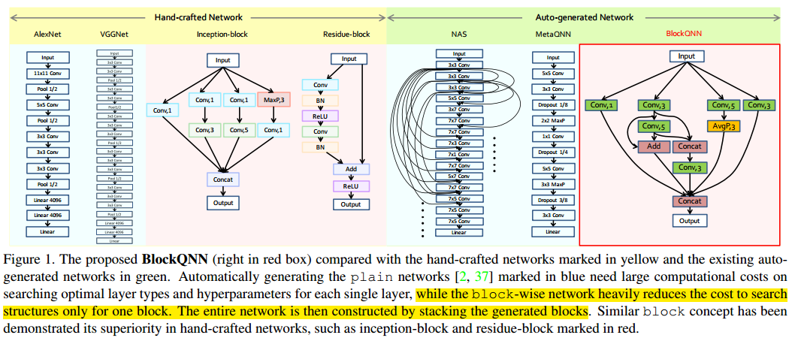

### 框架编码

| Network Structure Code Space                            | NSC示例                                                 |
| ------------------------------------------------------- | ------------------------------------------------------- |
| 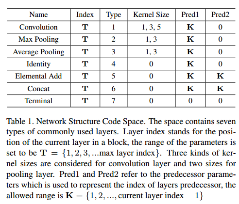 | 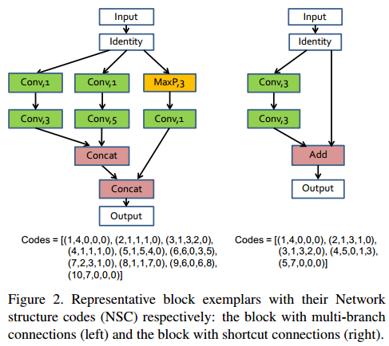 |

### Q-learning process illustration 

### Q-learning学习的有效性

> - (a)随机探索与Q-learning搜索的对比
> - (b)、(c)Top2的结构
> - (d)有参数限制下的最佳结构

## Path-Level Network Transformation for Efficient Architecture Search（ICML'18）

> 基于已有的网络，重用模型，重用权重对连接上的**路径级别进行修改**
>
> Efficient Architecture Search by Network Transformation主要是对层级别的网络进行修改，本篇文章主要对路径级别的网络进行修改

可参考解读文章：[Path-Level Network](https://blog.csdn.net/cFarmerReally/article/details/80887271)

### Path-Level的架构搜索

#### 为什么要做Path-Level的架构搜索？

> 因为已经有一些Multi-Brach Neural Networks取得了很好效果，我们需要提供一种方法可以改变旧网络的拓扑结构，使得我们有机会生成表征能力更强的类似Inception models, ResNets这样优秀的网络或更好的网络。

##### 定义如何拓宽网络 Net2WiderNet

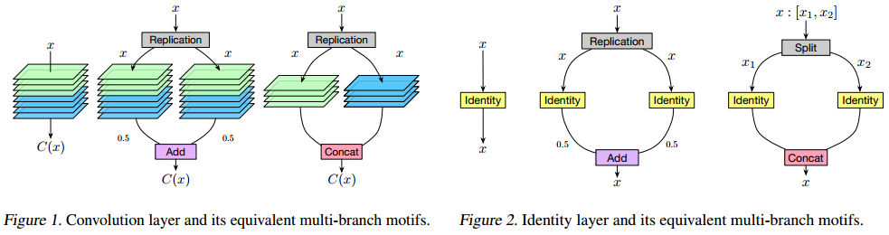

>定义两种操作，Replication-Add和Split-Concat：
>
>- Replication-Add是指将x复制成2份，分别操作后把结果除以2再相加，保证输入和输出和之前的维度相同。
>
>- Split-Concat是指将x按照维度切成两份，分别操作后再把结果相接，保证输入和输出和之前的维度相同。
##### **定义如何加深网络 Net2DeeperNet**

利用Net2DeeperNet在当前层后面加一个identity层(实现细节可以看论文中的相关链接Net2Net)

#### **定义Path-Level的架构搜索的数据结构**

> - a过程是Net2Wider的过程，
>
> - b过程是Net2Deep后再Net2Wider的过程，
>
> - c过程是对其中的层替换的过程，
>
> - d过程是把c过程定义成了我们的树结构
>
>   节点：分配和合并策略，边：层
>   由此，我们可以把整个过程看做是一个在树上搜索的过程。

#### 搜索

类似于Layer-Level的思想，但我们利用lstm来决定用哪一层，用Tree-lstm来决定我们该使用什么分配合并策略，最终完成Layer-Level的搜索，我们不难发现Tree的结构是节点和边交替出现的，所以Tree-lstm的输入是前一个lstm的输出，Tree-lstm的输出是后一个lstm的输入。

## HIERARCHICAL REPRESENTATIONS FOR EFFICIENT ARCHITECTURE SEARCH （ICLR'18，CMU&DeepMind）

> 提出了一种层次化的神经网络搜索空间，并通过进化算法进行搜索
>
> 参考：https://blog.csdn.net/dhaiuda/article/details/95722971

### hierarchical architecture representation 分层框架表示

> G是一个net的有向无环图，节点是feature map，边是对应的操作，该操作不再是简单的卷积，而可以是低一级G（有向无环图的操作）

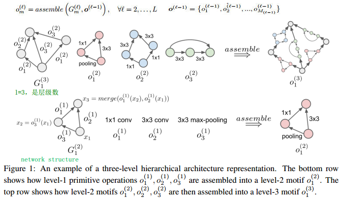

### 进化算法

#### 种群初始化

> 具体步骤如下：
>
> 1. 定义分层架构的层数，定义每层计算图的形状，定义第一层基础操作集
> 2. 初始化一批种群个体，个体中的每个cell都是直接映射，即输入等于输出
> 3. 对种群中的个体进行大规模的变异操作

#### 变异操作

> 具体步骤如下：
>
> 1. 随机选择一层，随机选择该层的一个计算图，随机选择该计算图的一个顶点i
> 2. 随机选择该计算图顶点i的后继结点j
> 3. 从基础操作集中随机选择一个操作替换现有操作，如果结点i与结点j不存在操作，此时相当于添加一条由结点i指向结点j的有向边
> 4. 上述步骤可以实现添加一条有向边，去除一条有向边，更改一条有向边对应的操作等

#### 选择

>1. 采用锦标赛选择算法，每次选出当前种群中5%的个体，
>2. 选择适应度（在验证集上的准确率）最高的个体，对其进行变异操作后产生新个体，新个体在训练一定轮数并计算适应度后放回种群中，
>3. 论文采取的锦标赛算法不会kill掉任何个体，随着算法的运行，种群的规模会不断增大

#### 随机搜索

> 随机搜索即去除掉锦标赛算法后的进化算法，即随机选择个体，随机进行变异操作

#### 算法的超参数

> 初始种群个数N
> 分层架构的层数L
> 每一层基础操作集中操作的个数
> 每一层的计算图架构

### 预先定义好的网络整体框架

> cell是通过学习得到的结构
>
> - small：用于搜索阶段的框架比较
> - large：用于评估学习的cell

## Neural Architecture Optimization (18'NeurIPS)

> 以往的基于RL和EA的方法多是在离散的搜索空间上搜索最优的框架,这是非常低效的.本文提出将网络模型通过编码器进行连续化,通过预测方程选出最佳的网络表示,再通过解码器将框架的连续表示进行离散化.
>
> [可参考](https://blog.csdn.net/favorxin/article/details/90206319)

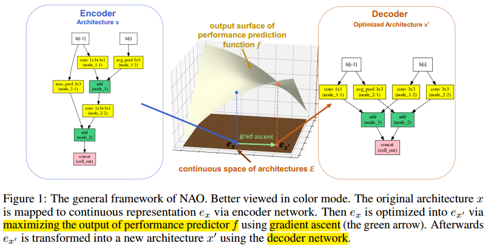

> - 编码器: 将离散的网络框架进行编码为一个连续的表示
> - 预测方程: 将连续的表示作为输入, 预测模型的性能
> - 解码器: 将选择出来的网络框架的连续化表示进行解码离散化

## Progressive Neural Architecture Search (ECCV'18)

> 学习cell结构, 从简单到复杂的方式**渐进地**学习一个cell结构, 通过拼接得到最终的模型, 对于候选模型的评估采用学习的预测函数进行预测, 得到候选模型的排序
>
> 可参考：https://blog.csdn.net/weixin_41943637/article/details/102155844

### Cell(5blocks) & Architecture

> cell中包含5个block,每个block有一个五元组组成(I1, I2, O1, O2, C) ：两个输入，两个对应的操作，一个合并的操作类型

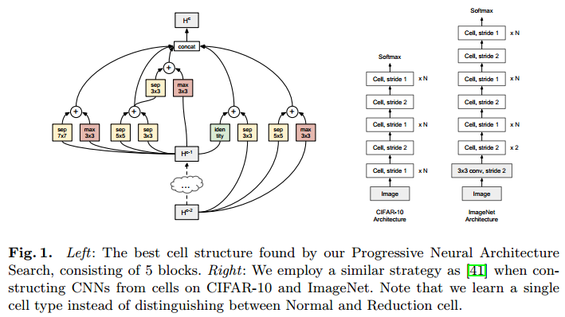

### 递增式cell的构建

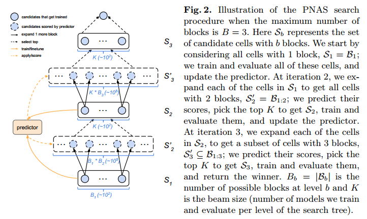

> - 蓝色的小圆圈：一个对应的框架
> - 黑色实线箭头：添加一个block

### 使用代理模型预测性能

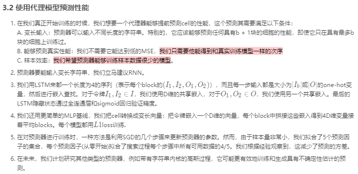

## Large-Scale Evolution of Image Classifiers (ICML'17)

> 使用EA算法尽可能减少人为干预的情况进化到一个具有好的性能的网络框架
>
> 可参考：https://blog.csdn.net/mynodex/article/details/96589377，https://blog.csdn.net/dhaiuda/article/details/95587258

>需要注意的几点：
>
>- 变异过后weight的形状如果没有改变，子框架可以**继承父代框架的权重**，禁用权重继承性能会有所下降
>- 没有将在小的数据集上得到的模型直接推广到大的数据集上，而是分别进行搜索评价

### 进化的实验过程

>上面的每个点都表示一个individual，其中灰色的点是被杀死的点，蓝色的点是存活下来的点。底下的四个框架是演变过程的一个例子。一开始的时候网络只有一个全局池化层，通过演变一步步变为最后的结构。从结构可以看出来，和人工设计的网络结构不同，这些网络结构有时会经历很多个非线性激活层。
>————————————————
>版权声明：本文为CSDN博主「mynodex」的原创文章，遵循 CC 4.0 BY-SA 版权协议，转载请附上原文出处链接及本声明。
>原文链接：https://blog.csdn.net/mynodex/article/details/96589377

### 进化算法/禁用权重继承的进化算法/随机搜索的性能对比

|                                                         |                                                         |
| ------------------------------------------------------- | ------------------------------------------------------- |
| 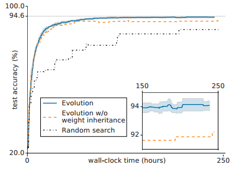 |  |

> 禁用权重继承性能会有所下降

## Genetic CNN(ICCV'17)

> *通过遗传算法进行神经网络架构搜索*，*论文首先提出了一种**能表示神经网络架构的编码方案**，在此编码方案上初始化种群，对种群进行选择、变异、交叉，从而抛弃性能差的神经网络架构并产生新的神经网络架构，论文将训练好的架构在验证集上的准确率作为评判网络性能好坏的指标*
>
> 可参考：https://blog.csdn.net/dhaiuda/article/details/95477009

### 遗传算法简介

> 传统的遗传算法往往具有下列步骤: 
>
> - 定义个体的基因编码方案
> - 初始化种群
> - 衡量个体生存竞争能力的适应度（通常是一个函数，函数值表示个体的生存竞争能力）
> - 淘汰适应度低的个体，选择适应度高的个体构成种群下一代的成员（选择）
> - 按一定概率对下一代成员进行基因的交叉与变异（交叉与变异），产生新个体的基因编码方案
> - 评估新种群的适应度
>
> 可以看到，遗传算法其实就是模仿生物进化的过程

### 框架的编码示例

>为了让每一个编码均有效，论文在每个阶段中额外定义了两个默认节点，对于第s个阶段来说，分别为上图中的红色和绿色节点，
>
>- 红色节点接收前一节点的输出，对其进行卷积，并将输出的特征图送往所有没有前驱但是有后继的节点，
>- 而绿色节点接受所有有前驱但是没后继节点输出的特征图，对其进行element-wise相加后，输入到池化层，这两个节点不做编码
>- 如果一个阶段的编码为0，则红色节点直接和绿色节点连接，即经过以此卷积操作后立刻进行池化操作。
>
>该论文也是选择在小数据集上探索网络架构，在将探索到的网络架构应用于大数据集.

| 网络编码示例                                            | 两个独立进化得到的网络框架                              |
| ------------------------------------------------------- | ------------------------------------------------------- |
| 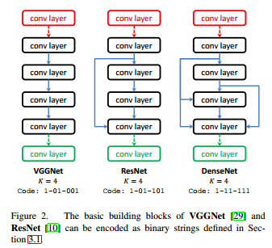 |  |

> 其他细节可参考：https://blog.csdn.net/dhaiuda/article/details/95477009

## FAST NEURAL NETWORK ADAPTATION VIA PARAMETER REMAPPING AND ARCHITECTURE SEARCH（ICLR20）

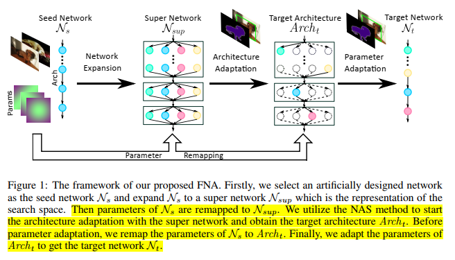

> 从一个设计好的人工网络开始，对其进行拓展得到super network，然后做架构自适应得到目标架构，然后做参数自适应得到目标网络。

## ONCE-FOR-ALL: TRAIN ONE NETWORK AND SPECIALIZE IT FOR EFFICIENT DEPLOYMENT ON DIVERSE HARDWARE PLATFORMS  （ICLR20）

> 将模型训练从架构搜索中解耦出来，来实现一次训练，挑选子网络进行不同平台的部署。
>
> 子网络之间相互共享权重，为了避免子网络之间相互影响，提出渐进收缩算法。
>
> [可参考](https://blog.csdn.net/qq_42738654/article/details/103852118)

## PC-DARTS: Partial Channel Connections for Memory-Efficient Architecture Search（ICLR20）

> 为了减少内存的消耗，对通道进行采样（1/k），只对部分通道进行卷积.
>
>  **边正则化**：缓解上述的“部分通道连接”操作会带来一些训练不稳定的问题
>
> [可参考](https://zhuanlan.zhihu.com/p/73740783)

